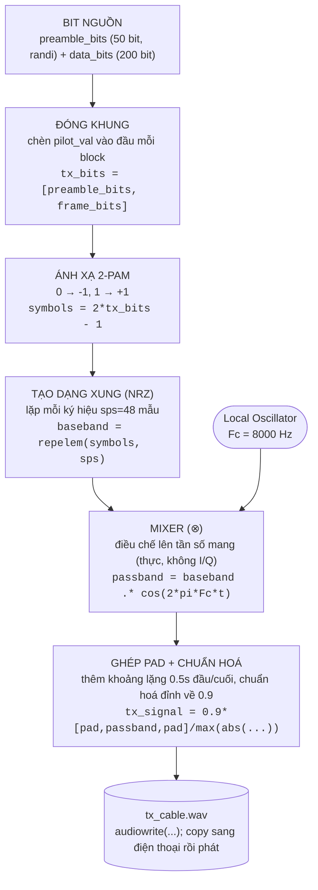
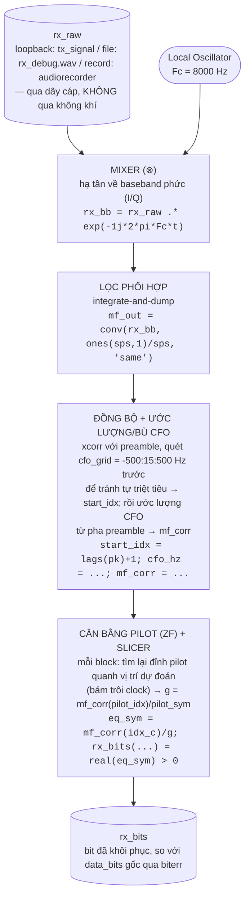
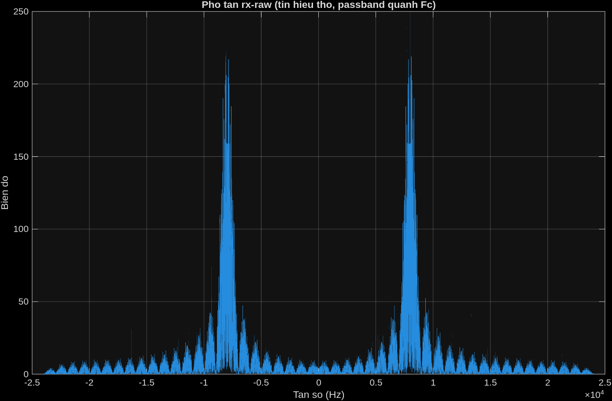
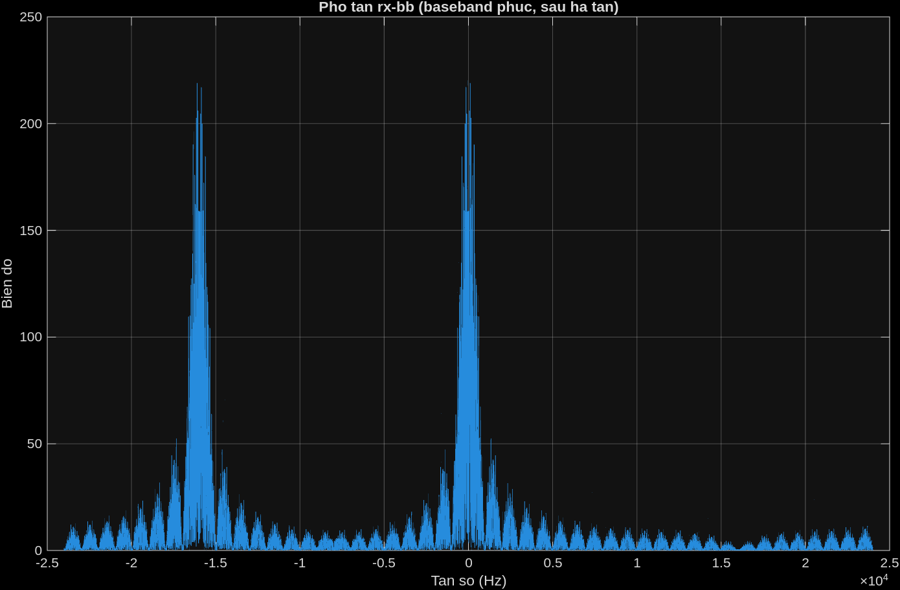
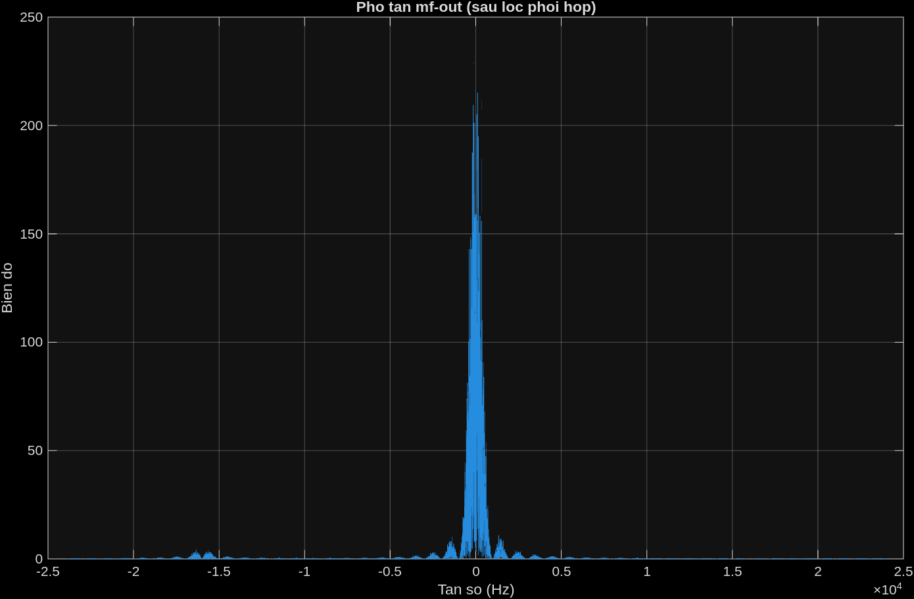

# tx_rx_basic
2-PAM (BPSK), ZF (zero-forcing), CFO (Carrier Frequency Offset), truyền qua cáp tai nghe
> [!NOTE]
> Nhiêu đây thực sự là cơ bản
> Symbol là ký hiệu, là ngôi sao, là mức
> Sample là mẫu, nhiều mẫu để biểu diễn 1 ký hiệu
# Cách chạy
- Chạy `Tx.m` sẽ xuất ra file `tx_cable.wav`, `tx_params.mat`
- Gửỉ file `tx_cable.wav` sang điên thoại
- Setup cáp tai nghe (line-in/mic) 
- Chạy `Rx.m` với biến `RX_SOURCE = 'record'`
- Phát `tx_cable.wav` trên điện thoại
- Khi đó terminal của matlab sẽ nghe và đo lỗi bit
# Chi tiết cách hoạt động
## Tx
**1. Setup tham số**
| Tham số | Giá trị |
| -------------- | --------------- |
| Fs (tần số lấy mẫu) | 48000 (Hz) |
| Fc (tần số sóng mang) | 8000 (Hz) |
| baud_rate (tốc độ ký hiệu) | 1000 (symbol/s) |
| sps (mẫu/ký hiệu) | Fs/baud_rate = 48 (sample/symbol)|
| bits_per_block (số bit trên 1 khối)| 10|
| num_blocks (số block)|20|
| pilot_val (bit plot)| 1|

**2. Sinh bit**
Sinh 50 bit biết truớc `preamble_bits` 50 bit này đựoc biết ở cả Tx và Rx, sinh `num_blocks x bits_per_block` bit data `data_bits`, chèn bit pilot có giá trị là `pilot_val` vào trong mỗi block trong `data_bits`.

```
preamble_bits = randi([0 1], 1, 50); % chuoi biet truoc de dong bo + uoc luong CFO
data_bits = randi([0 1], 1, num_blocks*bits_per_block);

frame_bits = zeros(1, num_blocks*(bits_per_block+1));
for k = 1:num_blocks
    blk = data_bits((k-1)*bits_per_block+1 : k*bits_per_block);
    frame_bits((k-1)*(bits_per_block+1)+1 : k*(bits_per_block+1)) = [pilot_val, blk];
end
tx_bits = [preamble_bits, frame_bits];

```
`frame_bits`: là `data_bits` đã đựoc chèn pilot

**3. Điều chế 2-PAM**
- 2-PAM là có M=2 mức 1 và -1, là 2 ký hiệu 1 và -1
- Mỗi ký hiệu cần log2(M) (=1) bit để biểu diễn
- Mỗi ký hiệu cần sps (=48) mẫu để biểu diễn
=> Mỗi bit cần 48 mẫu để biểu diễn
```
symbols = 2*tx_bits - 1;              % 0->-1, 1->+1
baseband = repelem(symbols, sps);     % xung vuong, integrate-and-dump o Rx se khop
```
Cách biểu diễn ký hiệu ví dụ: ký hiệu -1 thì sẽ đuợc nhân thành -1 -1 -1 -1 ... 48 số -1 (gọi là 48 mẫu -1)

**4. Đưa lên tần số sóng mang**
Nhân toàn bộ tín hiệu trên (biến `baseband`) với `cos(2*pi*Fc*t)`
```
t = (0:length(baseband)-1)/Fs;
passband = baseband .* cos(2*pi*Fc*t);
```
Tạo trục thời gian: mỗi mẫu cách nhau `1/Fs` (s) nên mẫu đầu tiên là từ 0 -> 1/Fs, mẫu thứ 2 là từ 
| thời gian | mẫu |
| -------------- | --------------- |
| 0 -> 1/Fs | mẫu 1 |
| 1/Fs -> 2/Fs | mẫu 2 |
| 2/Fs -> 3/Fs | mẫu 3 |
| 3/Fs -> 4/Fs | mẫu 4 |
| 4/Fs -> 5/Fs | mẫu 5 |
| 5/Fs -> 6/Fs | mẫu 6 |
| 6/Fs -> 7/Fs | mẫu 7 |
| 7/Fs -> 8/Fs | mẫu 8 |
| 8/Fs -> 9/Fs | mẫu 9 |
| 9/Fs -> 10/Fs | mẫu 10 |
|...|...|
| length(baseband)/Fs -> (length(baseband)-1)/Fs | mẫu length(baseband)|


**5. Thêm khoảng lặng**
```
pad = zeros(1, round(0.5*Fs));        % khoang lang dau/cuoi cho de bat dau ghi am
tx_signal = [pad, passband, pad];
tx_signal = 0.9 * tx_signal / max(abs(tx_signal));
```
pad = zeros(1, round(0.5*Fs)) ở Tx.m:30 — thêm 0.5s im lặng vào đầu và cuối tx_signal (Tx.m:31).
Lý do:
- Luôn có độ trễ vài trăm ms giữa lúc nhấn nút và lúc âm thanh thực sự phát/thu.
- Khoảng lặng đầu là vùng đệm để tín hiệu thật (frame 2-PAM) không bị cắt mất phần đầu nếu recorder khởi động chậm.
- Khoảng lặng cuối, phòng trường hợp việc phát kết thúc trước khi recorder kịp dừng hoặc ngược lại.
- Không ảnh hưởng giải mã vì Rx.m tìm frame bằng cross-correlation với preamble (Rx.m:55), không dựa vào vị trí mẫu cố định — im lặng thừa ở hai đầu bị bỏ qua tự nhiên.

Tx.m:32 — tx_signal = 0.9 * tx_signal / max(abs(tx_signal));
- Chia cho max(abs(...)): chuẩn hoá biên độ, đưa mẫu lớn nhất về đúng 1.0 — vì audiowrite yêu cầu giá trị trong khoảng [-1, 1], vượt quá sẽ bị clip (méo dạng sóng, phá hỏng symbol).
- Nhân với 0.9: chừa lại 10% headroom thay vì đẩy sát biên độ 1.0. Lý do thực tế: loa điện thoại + DAC + đường cáp có thể có overshoot nhỏ hoặc gain dương ở một số thiết bị, đẩy sát 1.0 dễ bị clip cứng khi phát thật. 0.9 là mức an toàn thường dùng, không phải số magic bắt buộc — có thể hạ xuống 0.7–0.8 nếu vẫn thấy clip trên rx_debug.wav.

**6. Ghi file**
Ghi file và lưu tham số cấu hình vào thôi
```
audiowrite('tx_cable.wav', tx_signal(:), Fs);
save('tx_params.mat', 'Fs', 'Fc', 'baud_rate', 'sps', 'bits_per_block', ...
    'num_blocks', 'pilot_val', 'preamble_bits', 'data_bits', 'tx_bits', 'tx_signal');
fprintf('Da ghi tx_cable.wav: %d bit du lieu trong %d block (preamble %d bit).\n', ...
    numel(data_bits), num_blocks, numel(preamble_bits));
fprintf('Copy file sang dien thoai, phat, roi chay Rx.m.\n');
```
## Rx
**1. Nạp tham số**
Nạp tham só từ file `tx_params.mat` xuất ra từ khi chạy `Tx.m`
```
if ~exist('Fs', 'var')
    load(fullfile(fileparts(mfilename('fullpath')), 'tx_params.mat'));
end
```
**2. Chọn nguồn tín hiệu**
Ghi âm 5s
```
RX_SOURCE = 'record'; % 'loopback' = tu-kiem-tra khong can dien thoai/cap that
                        % 'record'   = thu that qua cap tai nghe
                        % 'file'     = doc lai rx_debug.wav da thu truoc do (chan doan lai
                        %              khong can thu lai lan nua)

if strcmp(RX_SOURCE, 'loopback')
    rx_raw = tx_signal(:);
elseif strcmp(RX_SOURCE, 'file')
    rx_raw = audioread(fullfile(fileparts(mfilename('fullpath')), 'rx_debug.wav'));
else
    record_time = 5; % ghi thu that: chua biet tx_signal dai bao nhieu, mac dinh 5s
    input_device_id = -1; % ponytail: -1 = thiet bi mac dinh he thong; neu bi thu nham
                           % mic laptop thay vi cap tai nghe, chay audiodevinfo(1) de
                           % xem danh sach ID roi gan so do vao day
    if input_device_id >= 0
        rec = audiorecorder(Fs, 16, 1, input_device_id);
    else
        rec = audiorecorder(Fs, 16, 1);
    end
    disp('Bat dau phat tx_cable.wav tren dien thoai ngay bay gio...');
    recordblocking(rec, record_time);
    rx_raw = getaudiodata(rec);
    fprintf('Muc tin hieu thu duoc: peak=%.4f, rms=%.4f (gan 0 nghia la thu nham thiet bi hoac chua cam cap)\n', ...
        max(abs(rx_raw)), rms(rx_raw));
    audiowrite(fullfile(fileparts(mfilename('fullpath')), 'rx_debug.wav'), rx_raw, Fs); % ponytail: de soi lai neu decode sai
end
```
**3. Hạ tần xuống baseband phức**
```
% Ha tan xuong baseband phuc (I/Q)
t = (0:length(rx_raw)-1)'/Fs;
rx_bb = rx_raw .* exp(-1j*2*pi*Fc*t);
```
**4. Lọc phối hợp**
```
mf_out = conv(rx_bb, ones(sps,1)/sps, 'same');
```
**5. Đồng bộ + quét CFO thô**
```
preamble_sym = 2*preamble_bits - 1;
preamble_ref = repelem(preamble_sym, sps).';
n_full = (0:length(mf_out)-1)';
cfo_grid = -500:15:500;
best_peak = -1;
for cfo_try = cfo_grid
    derot = mf_out .* exp(-1j*2*pi*cfo_try*n_full/Fs);
    [c_try, lags_try] = xcorr(derot, preamble_ref);
    [pv, pk_try] = max(abs(c_try));
    if pv > best_peak
        best_peak = pv; c = c_try; lags = lags_try; pk = pk_try;
    end
end
peak_val = best_peak;
start_idx = lags(pk) + 1;
sync_confidence = peak_val / median(abs(c)); % thap (~vai lan) nghia la khong that su tim thay preamble
fprintf('Dong bo: peak/median tuong quan = %.1f (cang cao cang chac chan tim dung preamble)\n', sync_confidence);

if start_idx < 1 || start_idx + length(preamble_ref) - 1 > length(mf_out)
    error('Khong tim thay preamble trong tin hieu thu duoc.');
end
```
**6. Uớc luợng CFO chính xác**
```
preamble_seg = mf_out(start_idx : start_idx + length(preamble_ref) - 1);
sym_val = zeros(length(preamble_bits), 1);
for k = 1:length(preamble_bits)
    idx_c = (k-1)*sps + round(sps/2);
    sym_val(k) = preamble_seg(idx_c) * preamble_sym(k); % bu dau +-1
end
diffs = sym_val(2:end) .* conj(sym_val(1:end-1));
avg_step = angle(mean(diffs)); % trung binh vector, ben vung voi wraparound hon trung binh goc truc tiep
cfo_hz = avg_step / (2*pi*sps/Fs);
```
**7. Bù CFO**
```
n = (0:length(mf_out)-start_idx)';
mf_corr = mf_out(start_idx:end) .* exp(-1j*2*pi*cfo_hz*n/Fs);
```
**8. Giải mã từng block**
```
data_start = length(preamble_ref) + 1;
pilot_sym = 2*pilot_val - 1;
rx_bits = zeros(1, num_blocks*bits_per_block);
bit_ptr = 1;
timing_off = 0; % lech luy ke (mau) so voi vi tri danh nghia
search_win = round(sps/4); % ponytail: du bu drift GIUA 2 BLOCK lien tiep; drift nhanh hon thi tang so nay
block_timing = zeros(1, num_blocks); % ponytail: de in ra chan doan, khong dung de giai ma
for blk = 1:num_blocks
    blk_off_nom = data_start + (blk-1)*(bits_per_block+1)*sps;
    pilot_idx_nom = blk_off_nom + timing_off + round(sps/2) - 1;
    cand = pilot_idx_nom + (-search_win:search_win);
    cand = cand(cand >= 1 & cand <= length(mf_corr));
    [~, best_k] = max(abs(mf_corr(cand)));
    pilot_idx = cand(best_k);
    timing_off = pilot_idx - (blk_off_nom + round(sps/2) - 1); % cap nhat cho block sau
    block_timing(blk) = timing_off;
    blk_off = blk_off_nom + timing_off;
    g = mf_corr(blk_off + round(sps/2) - 1) / pilot_sym; % pilot o dau block
    for b = 1:bits_per_block
        idx_c = blk_off + b*sps + round(sps/2) - 1;
        eq_sym = mf_corr(idx_c) / g;
        rx_bits(bit_ptr) = real(eq_sym) > 0;
        bit_ptr = bit_ptr + 1;
    end
end
fprintf('Lech dinh pilot tich luy tung block (mau, +-%d la cua so tim): %s\n', search_win, mat2str(block_timing));
```
**9. Tính BER**
```
[num_err, ber] = biterr(data_bits, rx_bits);
fprintf('CFO uoc luong: %.2f Hz. So bit loi: %d / %d, BER = %.4f\n', ...
    cfo_hz, num_err, numel(data_bits), ber);
```
**10. Chuẩn đoán**
```
block_err = zeros(1, num_blocks);
for blk = 1:num_blocks
    idxs = (blk-1)*bits_per_block+1 : blk*bits_per_block;
    block_err(blk) = sum(rx_bits(idxs) ~= data_bits(idxs));
end
fprintf('Loi tung block (block 1..%d): %s\n', num_blocks, mat2str(block_err));
```
**11. Vẽ hình**
```
scatterplot(mf_corr(data_start:end));
title('Ky hieu du lieu sau can bang pilot');
figure; plot(real(rx_bb)); title('Baseband I sau ha tan');
```


---
---
Modem 2-PAM (BPSK) qua dây: laptop phát `tx_cable.wav`, copy sang điện thoại
phát lại, laptop ghi âm qua cáp tai nghe (line-in/mic) rồi giải mã lại thành
bit gốc và tính BER. "Kênh truyền" chỉ là dây cáp + loa/DAC điện thoại +
ADC laptop — không multipath, nhưng có lệch tần số/đồng hồ lấy mẫu thật
giữa hai máy.

Đây là bản sao độc lập của `Tx.m`/`Rx.m` (đã tách thành repo git riêng, push
lên https://github.com/ledangquangdangquang/tx-rx-basic). Sửa ở đây không tự
động đồng bộ ngược về thư mục gốc `code_Matlab` và ngược lại — copy tay
nếu cần.

## Chạy thế nào

1. Chạy `Tx.m` trước — sinh bit ngẫu nhiên (preamble 50 bit dùng để đồng bộ
   và ước lượng CFO, + 20 block dữ liệu, mỗi block gồm 1 bit pilot + 10 bit
   data), điều chế thành xung vuông NRZ ở tần số mang `Fc`, ghi ra
   `tx_cable.wav` và lưu toàn bộ tham số/bit vào `tx_params.mat`. Copy
   `tx_cable.wav` sang điện thoại.
2. Chạy `Rx.m`. Chọn nguồn tín hiệu qua biến `RX_SOURCE`:
   - `'loopback'` (mặc định) — tự kiểm tra bằng cách giải mã lại đúng
     `tx_signal` đang có trong workspace, không cần điện thoại/cáp (BER
     phải ra đúng 0).
   - `'record'` — ghi âm thật qua `audiorecorder` (bản ghi được lưu ra
     `rx_debug.wav` để soi lại nếu giải mã sai).
   - `'file'` — đọc lại `rx_debug.wav` đã ghi từ lần `'record'` trước đó,
     giải mã lại mà không cần cắm cáp/thu lại. **Lưu ý**: `rx_debug.wav`
     phải cùng lần chạy với `tx_params.mat` đang nạp (cùng `data_bits`) —
     nếu chạy lại `Tx.m` sau khi thu âm, `tx_params.mat` bị ghi đè và giải
     mã file cũ sẽ ra BER ~0.5 (so nhầm với bit của lần chạy khác, không
     phải lỗi kênh truyền).
3. Nếu workspace bị mất (restart MATLAB), `Rx.m` tự nạp lại tham số từ
   `tx_params.mat` — file này chỉ được tạo sau khi `Tx.m` đã chạy ít nhất
   một lần.

## Kênh truyền và tham số

Kênh truyền dùng dây cáp tai nghe (headphone cable) nối trực tiếp ngõ ra
loa/tai nghe của điện thoại vào ngõ vào line-in/mic của laptop — không
qua không khí (không phải kênh âm thanh vô tuyến).

- `Fs = 48000` Hz (sample rate), `Fc = 8000` Hz (tần số mang),
  `baud_rate = 1000` bit/s → `sps = 48` mẫu/ký hiệu.
- Khung: preamble 50 bit + 20 block × (1 bit pilot + 10 bit data) = 250 bit
  data thực (`bits_per_block = 10`, `num_blocks = 20`).
- **Mức âm lượng khi thu thật (`RX_SOURCE = 'record'`)**:
  - Điện thoại (phát): để loa ở mức ~30%.
  - Laptop (thu): input line-in/mic ở chế độ **stereo**, mức thu ~30%.
  - Chỉnh 2 mức này tương ứng để tránh clipping (quá to, méo tín hiệu) hoặc
    tín hiệu quá nhỏ lẫn vào nhiễu nền (quá nhỏ) — cả hai đều làm tăng BER.

### Ghi chú môi trường Linux

Để `audiorecorder`/`audiodevinfo` trong MATLAB nhận đúng thiết bị vào/ra
mặc định qua PulseAudio (thay vì ALSA không tìm thấy hoặc bắt nhầm thiết
bị), `~/.asoundrc` đã được chỉnh để trỏ `pcm.!default`/`ctl.!default` sang
`type pulse`:

```
pcm.!default {
    type pulse
}
ctl.!default {
    type pulse
}
```

Nếu `RX_SOURCE = 'record'` không thu được gì (peak/rms gần 0) hoặc
`audiorecorder` báo lỗi thiết bị, kiểm tra lại file này trước.

## Sơ đồ khối máy phát (`Tx.m`)



(Không có tầng khuếch đại công suất hay anten thật — output là file `.wav`.)

(Đối chiếu đúng thứ tự lệnh trong `Tx.m`; thuật ngữ mixer/LO chỉ để minh
hoạ tương ứng với sơ đồ Rx bên dưới — không có tầng khuếch đại công suất
hay anten thật, kênh là dây cáp.)

## Chuỗi giải điều chế ở `Rx.m`

Hạ tần xuống baseband phức (I/Q) → lọc phối hợp (integrate-and-dump) →
đồng bộ bằng tương quan chéo với preamble (quét thô CFO trước để tránh
tương quan tự triệt tiêu khi lệch tần số thật lớn) → ước lượng CFO từ độ
lệch pha giữa các ký hiệu liên tiếp của preamble (không unwrap tích luỹ cả
preamble, tránh nhảy sai 2π khi có mẫu nhiễu) → lấy mẫu từng ký hiệu, có
bám trôi đồng hồ lấy mẫu bằng tìm lại đỉnh pilot mỗi block (early-late đơn
giản) → cân bằng kênh zero-forcing theo pilot → slicer 2-PAM → `biterr`.
Thứ tự các bước này không đổi được tuỳ tiện — xem `CLAUDE.md` ở thư mục gốc
để biết chi tiết.

Biến workspace giữ nguyên quy ước: `Fs`, `Fc`, `baud_rate`, `sps`.

### Sơ đồ khối



(Đối chiếu đúng thứ tự code trong `Rx.m`, không phải suy diễn — thuật ngữ
mixer/LO/matched filter chỉ để minh hoạ tương ứng sơ đồ Tx ở trên, kênh
thật là dây cáp nên không có anten/LNA thật.)

## Ý nghĩa từng biến trung gian trong `Rx.m`

Đi theo đúng thứ tự các bước trong file (xem thêm "Chuỗi giải điều chế" ở
trên), số liệu minh hoạ lấy từ một lần chạy thật (`RX_SOURCE = 'file'`, đọc
lại `rx_debug.wav`).

### 1. Hạ tần xuống baseband: `rx_bb`

`rx_bb` là tín hiệu **baseband phức** ngay sau bước hạ tần
(`rx_bb = rx_raw .* exp(-1j*2*pi*Fc*t)`): mỗi mẫu thực của `rx_raw` bị nhân
với một pha quay `exp(-j*2*pi*Fc*t)` nên có cả phần thực lẫn phần ảo — phần
thực mang thông tin biên độ ký hiệu (giống tín hiệu I truyền thống), phần
ảo là phần vuông pha (Q) sinh ra do phép nhân phức, sẽ bị lọc bỏ dần ở các
bước sau. 10 mẫu đầu tiên của file luôn rơi vào đoạn `pad` (khoảng lặng
im lặng Tx chèn vào đầu/cuối file), nên giá trị rất nhỏ và không theo quy
luật cố định — đó là nền nhiễu của mic/ADC/loa lúc chưa có tín hiệu thật,
không phải dữ liệu:

```
>> rx_bb(1:10)
  -0.0012 + 0.0000i   -0.0000 + 0.0000i    0.0002 + 0.0003i   -0.0001 - 0.0000i
   0.0001 - 0.0002i    0.0000 + 0.0000i   -0.0001 - 0.0000i    0.0002 - 0.0003i
  -0.0001 - 0.0001i    0.0000 + 0.0000i
```

### 2. Lọc phối hợp: `mf_out`

`mf_out` là `rx_bb` sau khi qua **lọc phối hợp** (`conv(rx_bb, ones(sps,1)/sps, 'same')`
— tương đương integrate-and-dump, lấy trung bình trượt trên đúng độ dài
`sps` mẫu của một ký hiệu). Vì vẫn đang xét đúng 10 mẫu đầu (vẫn nằm trong
`pad`), lọc này chỉ đang trung bình hoá đúng đoạn nhiễu đó — nên biên độ
càng nhỏ hơn nữa (nhỏ hơn cả bậc, `1e-4` so với `1e-3`+ của `rx_bb`) vì
trung bình cộng của nhiễu ngẫu nhiên qua nhiều mẫu có xu hướng dồn về 0
nhanh hơn từng mẫu riêng lẻ:

```
>> mf_out(1:10)
   1.0e-04 *
  -0.4609 - 0.1156i   -0.3338 - 0.3359i   -0.3688 - 0.3964i   -0.4514 - 0.3964i
  -0.4196 - 0.4515i   -0.4641 - 0.5286i   -0.4832 - 0.5286i   -0.3751 - 0.7158i
  -0.4800 - 0.8975i   -0.5054 - 0.8975i
```

So hai đoạn trên với nhau là cách trực quan thấy đúng việc lọc phối hợp
làm: **giảm nhiễu bằng cách trung bình hoá**, còn việc dựng lại đúng biên
độ ±1 của ký hiệu chỉ xảy ra khi lấy mẫu đúng vị trí giữa mỗi ký hiệu bên
trong đoạn preamble/data thật (xem `scatterplot` bên dưới) — 10 mẫu đầu
tiên (trong `pad`) không phản ánh việc đó.

### 3. Đồng bộ khung: `preamble_ref`, `cfo_grid`, `c`/`lags`, `start_idx`, `peak_val`, `sync_confidence`

`preamble_ref` là dạng sóng **kỳ vọng** của 50 bit preamble (đã biết trước
ở cả Tx lẫn Rx) sau khi trải mỗi bit thành `sps` mẫu — dùng làm mẫu để so
khớp, không phải tín hiệu thu được.

`cfo_grid = -500:15:500` là danh sách các mức lệch tần số mang (Hz) đem thử
trước khi tương quan. Lý do phải quét thay vì tương quan thẳng `mf_out` với
`preamble_ref`: nếu CFO thật đủ lớn, pha trôi hết một vòng trong lúc tương
quan trên cả 50 ký hiệu preamble làm phép cộng tương quan tự triệt tiêu lẫn
nhau (tưởng như không tìm thấy preamble dù nó vẫn ở đó). Với mỗi mức thử
trong `cfo_grid`, `derot = mf_out .* exp(-j*2*pi*cfo_try*n/Fs)` xoay ngược
thử tín hiệu theo mức đó rồi `xcorr` với `preamble_ref` ra `c_try`/`lags_try`;
mức nào cho đỉnh tương quan `pv` cao nhất được giữ lại làm `c`, `lags`, `pk`.

- `peak_val` = độ lớn đỉnh tương quan cao nhất tìm được.
- `start_idx = lags(pk) + 1` = vị trí mẫu (trong `mf_out`) mà preamble thật
  sự bắt đầu — mọi chỉ số phía sau (`data_start`, `blk_off`...) đều tính
  từ mốc này.
- `sync_confidence = peak_val / median(abs(c))` = tỉ lệ đỉnh/nền tương
  quan. Ví dụ một lần chạy thật: `sync_confidence ≈ 99696` — rất cao nghĩa
  là đỉnh nổi bật hẳn so với nền, gần như chắc chắn đúng preamble; nếu chỉ
  vài lần (vài chục) thì đỉnh đó có thể chỉ là trùng hợp ngẫu nhiên, không
  nên tin `start_idx` tìm được.

### 4. Ước lượng CFO: `preamble_seg`, `sym_val`, `diffs`, `avg_step`, `cfo_hz`

`preamble_seg` = đúng đoạn `mf_out` tương ứng 50 ký hiệu preamble, cắt ra
từ `start_idx`. `sym_val(k)` lấy 1 mẫu giữa mỗi ký hiệu preamble rồi nhân
với `preamble_sym(k)` (±1 đã biết trước) để bù dấu — nếu không có CFO/nhiễu,
mọi phần tử của `sym_val` sẽ có cùng một pha (chỉ khác biên độ do nhiễu).

`diffs = sym_val(2:end) .* conj(sym_val(1:end-1))` là **hiệu pha giữa hai
ký hiệu liên tiếp** (nhân với liên hợp phức = trừ pha). CFO làm pha trôi
đều đặn theo thời gian nên mỗi `diffs(k)` xoay cùng một góc — `avg_step`
lấy góc của **trung bình vector** (không phải trung bình góc thô, để bền
với nhiễu wraparound quanh ±π). Từ đó suy ra tần số:
`cfo_hz = avg_step / (2*pi*sps/Fs)` — góc trôi mỗi ký hiệu, chia cho thời
gian một ký hiệu (`sps/Fs` giây), ra đơn vị Hz. Ví dụ thực tế: `cfo_hz ≈
-22.03 Hz` — điện thoại và laptop lệch đồng hồ tạo dao động khoảng đó,
không cố định giữa các lần chạy/thiết bị.

*Vì sao tính hiệu pha từng cặp thay vì `unwrap` rồi `polyfit` trên cả 50
điểm*: một mẫu nhiễu/méo bất thường (rất dễ gặp trên cáp thật) có thể làm
`unwrap` nhảy sai hẳn 2π, kéo theo `polyfit` suy ra một CFO giả rất lớn.
Tính từng cặp liên tiếp giới hạn thiệt hại của 1 mẫu lỗi vào đúng 1 cặp đó.

10 mẫu đầu của `preamble_seg` — tức đúng 10 mẫu đầu của `mf_out` nhưng lấy
từ `start_idx` trở đi thay vì từ đầu file — đã là tín hiệu thật (biên độ
`~0.07-0.09`), khác hẳn phần nhiễu nền `~1e-4` ở bước 1-2 vì giờ đây không
còn nằm trong đoạn `pad` nữa:

```
>> preamble_seg(1:10)
  -0.0743 + 0.0020i   -0.0758 + 0.0047i   -0.0771 + 0.0025i   -0.0821 + 0.0025i
  -0.0837 + 0.0053i   -0.0849 + 0.0032i   -0.0900 + 0.0032i   -0.0915 + 0.0059i
  -0.0927 + 0.0039i   -0.0979 + 0.0039i
```

### 5. Bù CFO: `mf_corr`

`mf_corr = mf_out(start_idx:end) .* exp(-j*2*pi*cfo_hz*n/Fs)` — áp `cfo_hz`
vừa ước lượng để xoay ngược pha, bắt đầu tính từ `start_idx` (bỏ hẳn phần
`pad`/nhiễu trước preamble). Từ đây trở đi lý tưởng là mỗi ký hiệu đã đứng
yên về pha, chỉ còn lệch biên độ/pha hằng số do kênh truyền (dây cáp +
loa + mic) — phần đó do bước cân bằng pilot ở dưới xử lý tiếp.

10 mẫu đầu của `mf_corr` — đúng cùng vị trí với `preamble_seg` ở trên, chỉ
khác là đã xoay bù CFO. Phần thực gần như không đổi (biên độ ký hiệu không
phụ thuộc CFO), nhưng phần ảo co lại rõ rệt (ví dụ mẫu thứ 8: từ `+0.0059i`
xuống `+0.0040i`) — đúng cái CFO làm: kéo pha đứng yên lại thay vì trôi dần:

```
>> mf_corr(1:10)
  -0.0743 + 0.0020i   -0.0758 + 0.0045i   -0.0771 + 0.0021i   -0.0822 + 0.0018i
  -0.0838 + 0.0043i   -0.0849 + 0.0020i   -0.0900 + 0.0017i   -0.0916 + 0.0040i
  -0.0927 + 0.0018i   -0.0980 + 0.0014i
```

### 6. Lấy mẫu + cân bằng từng block: vòng lặp `for blk = 1:num_blocks`

Mỗi block gồm 1 bit pilot (giá trị đã biết, `pilot_val`) rồi tới
`bits_per_block` bit data. Vòng lặp làm hai việc cùng lúc: **bám trôi
đồng hồ lấy mẫu** và **cân bằng biên độ/pha theo pilot**.

- `blk_off_nom` = vị trí *lý thuyết* của block (nếu đồng hồ hai máy khớp
  tuyệt đối), tính thẳng từ `data_start` và số thứ tự block.
- `timing_off` = độ lệch **luỹ kế** (tính bằng số mẫu) so với lý thuyết,
  mang từ block trước sang — đại diện cho việc đồng hồ lấy mẫu của điện
  thoại/laptop trôi dần theo thời gian.
- `pilot_idx_nom` = vị trí dự đoán của đỉnh pilot (lý thuyết + lệch luỹ kế
  từ block trước), `cand` là một cửa sổ nhỏ (`±search_win`, ở đây
  `search_win = round(sps/4) = 12` mẫu) quanh vị trí dự đoán đó.
- `pilot_idx` = vị trí trong `cand` có biên độ `|mf_corr|` lớn nhất — coi
  đó là đỉnh pilot thật của block này (early-late tracking đơn giản: tìm
  lại đỉnh thay vì tin cứng vị trí lý thuyết).
- `timing_off` được cập nhật lại = chênh lệch giữa `pilot_idx` thật và vị
  trí lý thuyết, mang tiếp sang block sau. `block_timing` chỉ lưu lại dãy
  `timing_off` qua từng block để in ra chẩn đoán, không dùng để giải mã.
  Ví dụ thực tế, lệch tăng dần đều: `[3 8 8 8 9 11 11 14 14 20 19 21 22 24
  27 16 26 29 33 30]` (mẫu) — tăng dần chứng tỏ có clock drift thật giữa
  hai máy, không phải nhiễu ngẫu nhiên (nhiễu ngẫu nhiên sẽ dao động quanh
  0, không trôi một chiều).
- `g = mf_corr(...pilot...) / pilot_sym` = **hệ số kênh** ước lượng từ
  chính pilot: lấy mẫu tại đỉnh pilot rồi chia cho giá trị pilot đã biết
  (`pilot_sym = ±1`) — vì kênh (cáp + loa + mic) chỉ nhân tín hiệu với một
  hệ số phức gần như không đổi trong 1 block ngắn, `g` gần đúng bằng đúng
  hệ số đó.
- Với mỗi bit data trong block: `eq_sym = mf_corr(idx_c) / g` — **cân bằng
  zero-forcing**, chia cho `g` để "gỡ" ảnh hưởng kênh, đưa ký hiệu về gần
  lại đúng ±1 gốc. `rx_bits(bit_ptr) = real(eq_sym) > 0` là **slicer 2-PAM**
  cuối cùng: chỉ cần dấu phần thực để quyết định bit 0/1.

10 ký hiệu đã cân bằng của block 1 (đúng `bits_per_block = 10` giá trị,
1 giá trị/bit data) — so với biên độ `~0.07-0.09` lúc chưa cân bằng ở bước
4-5, giờ phần thực đã kéo về sát ±1 và phần ảo gần như triệt tiêu, đúng
việc `g` (hệ số kênh ước lượng từ pilot) làm — gỡ bỏ suy hao/lệch pha do
dây cáp + loa + mic:

```
>> eq_sym_blk1  % = mf_corr(...) / g, 1 gia tri / bit data trong block 1
  -0.9574 + 0.0393i    0.9565 - 0.0356i    0.9988 + 0.0046i   -0.9577 + 0.0329i
  -0.9980 - 0.0078i   -0.9986 - 0.0075i    0.9538 - 0.0189i   -0.9493 + 0.0127i
   0.9435 - 0.0051i   -0.9345 - 0.0010i
```

### 7. Kết quả: `num_err`, `ber`, `block_err`

`[num_err, ber] = biterr(data_bits, rx_bits)` so trực tiếp bit gốc (Tx) với
bit vừa giải mã, ra số bit sai và tỉ lệ lỗi bit. `block_err(blk)` đếm lỗi
riêng từng block để phân biệt hai kiểu lỗi: lỗi rải đều ngẫu nhiên trên các
block (nghi nhiễu nền) so với lỗi **tăng dần về cuối khung** (nghi do trôi
đồng hồ lấy mẫu chưa bám kịp, xem thêm `bai_hoc.md`/`CLAUDE.md` ở thư mục
gốc). Ở lần chạy minh hoạ trên, `block_err` toàn số 0 (`ber = 0`) — cân
bằng + bám trôi đã đủ tốt cho lần thu đó, dù `timing_off` vẫn trôi dần.

10 bit đầu tiên sau slicer (`> 0` trên phần thực của `eq_sym_blk1` ở trên)
khớp đúng 10 bit gốc `data_bits(1:10)` — chốt lại toàn bộ chuỗi: nhiễu nền
`~1e-4` → tín hiệu preamble thật `~0.08` → pha đứng yên sau bù CFO →
biên độ ±1 sau cân bằng pilot → bit 0/1:

```
>> rx_bits(1:10)      0  1  1  0  0  0  1  0  1  0
>> data_bits(1:10)    0  1  1  0  0  0  1  0  1  0
```

Toàn bộ số liệu ở trên lấy từ script `print_pipeline_samples.m` (chạy
`Tx.m` + `Rx.m` rồi in 10 mẫu đầu ở mỗi bước) — chạy lại file này để lấy
số liệu mới nếu đổi tham số hoặc thu âm mới.

## Ví dụ số: bit → ký hiệu → trôi pha CFO → bù CFO

Ví dụ minh hoạ tay (số tròn, không lấy từ 1 lần chạy thật) cho đúng 4 bước
ước lượng/bù CFO ở mục 4-5 phía trên. Số phức viết theo dạng **biên độ∠góc**
(`r∠θ`, biên độ = 1 cho gọn) thay vì `a+jb`, vì phép nhân trong bước này chỉ
là **nhân biên độ, cộng góc** — không cần khai triển thực/ảo. Mỗi giá trị
dưới đây là 1 **ký hiệu** (1 điểm đại diện 1 bit, lấy tại tâm `sps` mẫu),
không phải 1 **mẫu** rời rạc.

6 bit preamble ví dụ: `1 0 1 1 0 1`, giả sử CFO thật = 20 Hz,
`baud_rate = 1000` → mỗi ký hiệu (`T = 1ms`) trôi thêm
`2π·20·0.001 ≈ 7.2°`.

**Bước 1 — bit → ký hiệu (Tx):** biên độ luôn = 1, chỉ góc mang thông tin bit.

| k | bit gốc | ký hiệu `r∠θ` |
|---|---|---|
| 1 | 1 | `1∠0°` |
| 2 | 0 | `1∠180°` |
| 3 | 1 | `1∠0°` |
| 4 | 1 | `1∠0°` |
| 5 | 0 | `1∠180°` |
| 6 | 1 | `1∠0°` |

**Bước 2 — ký hiệu bị trôi pha (kênh + CFO):** biên độ không đổi, CFO
**cộng thêm góc** `7.2°×(k-1)` vào mọi ký hiệu, bất kể bit là gì:

| k | ký hiệu gốc | + drift | = ký hiệu đo được ở Rx |
|---|---|---|---|
| 1 | `1∠0°` | +0.0° | `1∠0.0°` |
| 2 | `1∠180°` | +7.2° | `1∠187.2°` |
| 3 | `1∠0°` | +14.4° | `1∠14.4°` |
| 4 | `1∠0°` | +21.6° | `1∠21.6°` |
| 5 | `1∠180°` | +28.8° | `1∠208.8°` |
| 6 | `1∠0°` | +36.0° | `1∠36.0°` |

Cột cuối vừa nhảy 180° (đổi bit) vừa trôi dần (CFO) — trộn lẫn nhau, chưa
nhìn ra CFO trực tiếp.

**Bước 3 — xử lý để *ước lượng* CFO** (tương ứng `sym_val` trong code, chỉ
dùng nội bộ, không dùng để giải mã): nhân mỗi ký hiệu với `preamble_sym(k)`
(đã biết trước, chính là `1∠0°` hoặc `1∠180°`) → **cộng góc** để gỡ nhảy
180° do bit, chỉ còn lại phần trôi thuần tuý:

| k | ký hiệu đo được | × preamble_sym | = sym_val (cộng góc) |
|---|---|---|---|
| 1 | `1∠0.0°` | `1∠0°` | `1∠0.0°` |
| 2 | `1∠187.2°` | `1∠180°` | `1∠7.2°` |
| 3 | `1∠14.4°` | `1∠0°` | `1∠14.4°` |
| 4 | `1∠21.6°` | `1∠0°` | `1∠21.6°` |
| 5 | `1∠208.8°` | `1∠180°` | `1∠28.8°` |
| 6 | `1∠36.0°` | `1∠0°` | `1∠36.0°` |

Giờ góc tăng đều **7.2°/bước** → `diffs` (hiệu góc giữa 2 ký hiệu liên
tiếp) đều = 7.2° → `avg_step = 7.2°` → `cfo_hz = avg_step/(2π·T) =
0.1257/(2π×0.001) = 20 Hz`, khớp giá trị giả định.

**Bước 4 — bù CFO cho *toàn bộ* ký hiệu** (tương ứng `mf_corr`, kể cả data
phía sau, không cần biết bit là gì): nhân với `exp(-j·2π·cfo_hz·t)` =
**cộng góc** `−7.2°×(k-1)` vào đúng ký hiệu đo được ở Bước 2 (không phải
`sym_val` đã gỡ dấu ở Bước 3):

| k | ký hiệu đo được | + correction | = ký hiệu phục hồi | slicer (`cos θ`) | bit |
|---|---|---|---|---|---|
| 1 | `1∠0.0°` | −0.0° | `1∠0.0°` | `+` | **1** |
| 2 | `1∠187.2°` | −7.2° | `1∠180.0°` | `−` | **0** |
| 3 | `1∠14.4°` | −14.4° | `1∠0.0°` | `+` | **1** |
| 4 | `1∠21.6°` | −21.6° | `1∠0.0°` | `+` | **1** |
| 5 | `1∠208.8°` | −28.8° | `1∠180.0°` | `−` | **0** |
| 6 | `1∠36.0°` | −36.0° | `1∠0.0°` | `+` | **1** |

Kết quả `1 0 1 1 0 1` — khớp đúng bit gốc. Bước 3 chỉ là mẹo *đo* CFO (biết
trước bit preamble nên gỡ được dấu); Bước 4 mới là phép *sửa* thật, áp
dụng đồng loạt cho mọi ký hiệu phía sau vì `cfo_hz` là một số duy nhất
dùng chung cho cả khung — đúng code:
`mf_corr = mf_out(start_idx:end) .* exp(-1j*2*pi*cfo_hz*n/Fs)`.

### Vì sao vẫn cần cân bằng pilot (ZF) sau khi đã bù CFO?

Ví dụ CFO ở trên giả định biên độ luôn = 1 — đơn giản hoá. Thực tế dây cáp
+ loa điện thoại + mic laptop tạo thêm một **hệ số kênh chưa biết** `g`
(suy hao biên độ + lệch pha cố định do thiết bị/mức volume) — khác CFO ở
chỗ **không tăng dần theo thời gian** nên không tính bù trước bằng công
thức được, chỉ có thể **đo trực tiếp** bằng 1 bit đã biết trước (pilot)
mỗi block rồi chia ngược cho các bit data cùng block (zero-forcing).

Tiếp tục ví dụ CFO: sau Bước 4 (đã bù CFO), xét 1 block gồm pilot + 4 bit
data (rút gọn từ 10 bit thật): pilot = `1`, data = `1 0 1 0`. Giả sử
`g = 0.5∠30°` (suy hao còn 0.5, lệch thêm 30°, hằng số trong block này).

**Bước 1 — bit → ký hiệu kỳ vọng (đã bù CFO, kênh lý tưởng):**

| | bit | ký hiệu kỳ vọng |
|---|---|---|
| pilot | 1 | `1∠0°` |
| data1 | 1 | `1∠0°` |
| data2 | 0 | `1∠180°` |
| data3 | 1 | `1∠0°` |
| data4 | 0 | `1∠180°` |

**Bước 2 — qua kênh thật (nhân với `g`):** nhân biên độ, cộng góc:

| | ký hiệu kỳ vọng | × g | = ký hiệu đo được (`mf_corr`) |
|---|---|---|---|
| pilot | `1∠0°` | `0.5∠30°` | `0.5∠30°` |
| data1 | `1∠0°` | `0.5∠30°` | `0.5∠30°` |
| data2 | `1∠180°` | `0.5∠30°` | `0.5∠210°` |
| data3 | `1∠0°` | `0.5∠30°` | `0.5∠30°` |
| data4 | `1∠180°` | `0.5∠30°` | `0.5∠210°` |

Đây là cái Rx thực sự đo được — biên độ nhỏ lại và pha lệch 30° so với
0°/180° gốc dù CFO đã bù xong. Nếu `g` lệch pha lớn hơn (vd 100°), dấu
`cos θ` có thể đổi chiều dù bit không đổi — đây là lý do bắt buộc phải
chia cho `g`, không thể bỏ qua bước này.

**Bước 3 — đo `g` từ pilot** (code: `g = mf_corr(pilot)/pilot_sym`): chia
hai số biên độ∠góc = **chia biên độ, trừ góc**:

```
g = (0.5∠30°) / (1∠0°) = (0.5/1) ∠ (30°-0°) = 0.5∠30°
```

→ đúng bằng hệ số kênh thật, vì pilot là "thước đo" biết trước để lộ ra `g`.

**Bước 4 — cân bằng zero-forcing từng data** (code: `eq_sym = mf_corr(data)/g`):

| | ký hiệu đo được | ÷ g | = eq_sym | slicer (`cos θ`) | bit |
|---|---|---|---|---|---|
| data1 | `0.5∠30°` | `0.5∠30°` | `1∠0°` | `+` | **1** |
| data2 | `0.5∠210°` | `0.5∠30°` | `1∠180°` | `−` | **0** |
| data3 | `0.5∠30°` | `0.5∠30°` | `1∠0°` | `+` | **1** |
| data4 | `0.5∠210°` | `0.5∠30°` | `1∠180°` | `−` | **0** |

Kết quả `1 0 1 0` — khớp bit gốc, biên độ kéo về đúng 1, pha về đúng
0°/180°.

**So với CFO:** CFO sửa bằng cách **cộng một góc tính trước theo thời
gian** (`-7.2°×(k-1)`); pilot equalization sửa bằng cách **chia cho một
số đo trực tiếp từ dữ liệu thật** (`g`, không có công thức tính trước vì
phụ thuộc thiết bị/volume). Vì `g` chỉ coi là hằng số **trong 1 block**,
code phải đo lại `g` mới ở đầu mỗi block (`for blk = 1:num_blocks`) chứ
không dùng chung 1 giá trị cho cả khung như `cfo_hz`.

## Hình minh họa

Sinh bằng cách chạy `gen_readme_images.m` (chạy `Tx.m` + `Rx.m` rồi lưu các
hình ra `img/`) — chạy lại file này để tạo hình mới nếu đổi tham số.



Phổ tần `rx_raw` (tín hiệu thô thu được): hai đỉnh đối xứng tại `±Fc =
±8000 Hz` — đúng dạng phổ của tín hiệu thực điều chế lên tần số mang bằng
`cos(2*pi*Fc*t)` (nhân với cos đưa phổ baseband lên cả hai bên `+Fc` và
`-Fc`).



Phổ tần `rx_bb` sau hạ tần: đỉnh ở `+Fc` bị kéo về đúng `0 Hz` (đây là phổ
baseband thật cần lấy), còn đỉnh còn lại bị đẩy ra `-2*Fc = -16000 Hz` —
hệ quả của phép nhân phức `exp(-j*2*pi*Fc*t)` dịch cả phổ đi `-Fc` thay vì
gập nó lại như nhân với cos thực.



Phổ tần `mf_out` sau lọc phối hợp: đỉnh giả ở `-16000 Hz` hầu như biến mất,
chỉ còn lại đúng dải hẹp quanh `0 Hz` — lọc phối hợp (integrate-and-dump,
về bản chất là một bộ lọc thông thấp) đã loại bỏ ảnh phổ `-2*Fc` lẫn nhiễu
tần số cao, giữ lại đúng phần baseband mang bit dữ liệu.


Chòm sao 2-PAM sau cân bằng: hai cụm điểm tách rõ quanh trục thực (bit 0/1),
độ tán ra theo trục ảo là nhiễu pha còn sót lại sau bù CFO.


Phần I của tín hiệu sau hạ tần: đoạn giữa có biên độ lớn là khung tín hiệu
thật (preamble + data), hai bên là khoảng lặng `pad` — nhìn hình này để
kiểm tra khung có nằm giữa khoảng lặng đầu/cuối như kỳ vọng không.


Spectrogram: dải năng lượng quanh `Fc = 8000 Hz` chỉ xuất hiện đúng lúc
khung tín hiệu được phát, hữu ích để soi CFO/nhiễu trôi theo thời gian rõ
hơn xem FFT tĩnh trên cả file.
