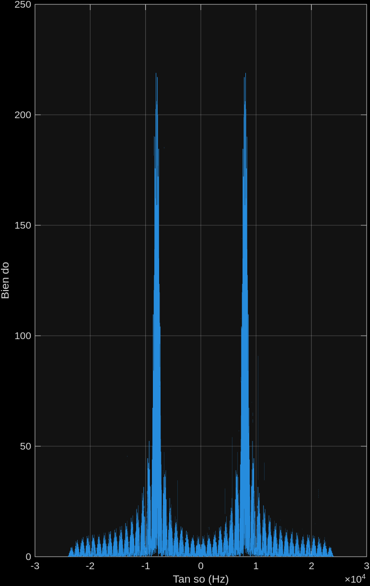
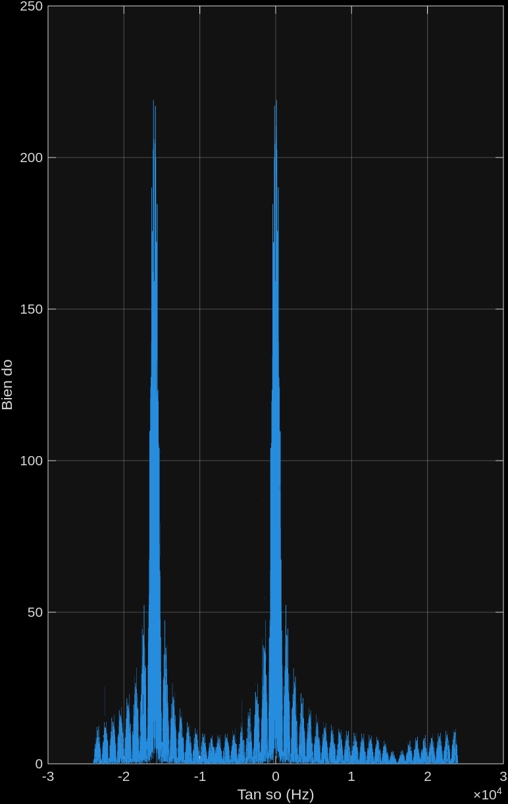
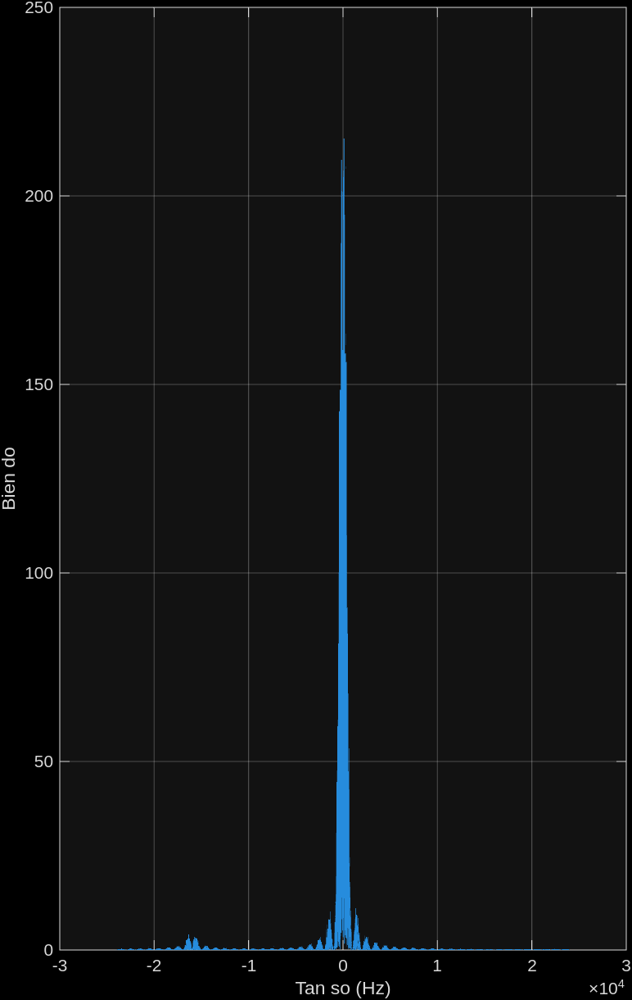

# tx_rx_basic
2-PAM (BPSK), ZF (zero-forcing), CFO (Carrier Frequency Offset), truyền qua cáp tai nghe
> [!NOTE]
> Nhiêu đây thực sự là cơ bản
> Symbol là ký hiệu, là ngôi sao, là mức
> Sample là mẫu, nhiều mẫu để biểu diễn 1 ký hiệu
# Cách chạy
- Chạy `Tx.m` sẽ xuất ra file `tx_cable.wav`, `tx_params.mat`
- Gửỉ file `tx_cable.wav` sang điên thoại
- Setup cáp tai nghe (line-in/mic) 
- Chạy `Rx.m` với biến `RX_SOURCE = 'record'`
- Phát `tx_cable.wav` trên điện thoại
- Khi đó terminal của matlab sẽ nghe và đo lỗi bit
# Chi tiết cách hoạt động
## Tx

**1. Setup tham số**
| Tham số | Giá trị |
| -------------- | --------------- |
| Fs (tần số lấy mẫu) | 48000 (Hz) |
| Fc (tần số sóng mang) | 8000 (Hz) |
| baud_rate (tốc độ ký hiệu) | 1000 (symbol/s) |
| sps (mẫu/ký hiệu) | Fs/baud_rate = 48 (sample/symbol)|
| bits_per_block (số bit trên 1 khối)| 10|
| num_blocks (số block)|20|
| pilot_val (bit plot)| 1|

Để làm gì: cố định các thông số mà Tx và Rx phải dùng chung.
- `Fs`: số mẫu/giây của file wav, phải > 2·`Fc` (Nyquist); chia hết cho `baud_rate` để `sps` nguyên.
- `Fc = 8000`: đẩy tín hiệu lên giữa dải âm thanh vì đường audio thường không truyền tốt thành phần quanh 0 Hz. `2·Fc = 16·baud_rate` (xem chương "Lọc phối hợp làm mất những tần số nào").
- `baud_rate = 1000`: 1 ký hiệu = 1 ms; băng thông chính khoảng ±1 kHz quanh `Fc`.
- `sps = Fs/baud_rate`: số mẫu của 1 ký hiệu, phải nguyên vì `repelem` ở bước 3.
- `bits_per_block`, `num_blocks`: 20 block × 10 bit = 200 bit dữ liệu. Thêm 1 pilot nên 1 block = 11 ký hiệu = 528 mẫu.
- `pilot_val`: bit Rx đã biết ở đầu mỗi block, dùng để đo lại kênh (Rx bước 8).

**2. Sinh bit**

Sinh 50 bit biết truớc `preamble_bits` 50 bit này đựoc biết ở cả Tx và Rx, sinh `num_blocks x bits_per_block` bit data `data_bits`, chèn bit pilot có giá trị là `pilot_val` vào trong mỗi block trong `data_bits`.

```
preamble_bits = randi([0 1], 1, 50); % chuoi biet truoc de dong bo + uoc luong CFO
data_bits = randi([0 1], 1, num_blocks*bits_per_block);

frame_bits = zeros(1, num_blocks*(bits_per_block+1));
for k = 1:num_blocks
    blk = data_bits((k-1)*bits_per_block+1 : k*bits_per_block);
    frame_bits((k-1)*(bits_per_block+1)+1 : k*(bits_per_block+1)) = [pilot_val, blk];
end
tx_bits = [preamble_bits, frame_bits];

```
`frame_bits`: là `data_bits` đã đựoc chèn pilot

Để làm gì: tạo dãy bit phát, gồm phần Rx biết trước (preamble, pilot) và phần Rx phải đoán (dữ liệu).
- `preamble_bits`: 50 bit ngẫu nhiên, Rx cũng có (qua `tx_params.mat`). Rx dùng nó để dò khung và đo CFO. Dài 50 ký hiệu (50 ms) để đỉnh tương quan cao hơn nền nhiễu.
- `data_bits`: 200 bit cần truyền, dùng để đếm lỗi.
- vòng `for k`: lấy 10 bit thứ k (`blk`) rồi ghép `[pilot_val, blk]` vào 11 ô của block k trong `frame_bits`. `(k-1)*bits_per_block+1 : k*bits_per_block` là đọc 10 bit, `(k-1)*(bits_per_block+1)+1 : k*(bits_per_block+1)` là ghi 11 bit.
- Pilot ở mỗi block (không chỉ đầu khung) vì gain/pha kênh đổi theo thời gian, cần đo lại thường xuyên.
- `tx_bits = [preamble_bits, frame_bits]`: thứ tự phát thực tế. `data_start`, `blk_off_nom` ở Rx dựa đúng thứ tự này.

**3. Điều chế 2-PAM**
- 2-PAM là có M=2 mức 1 và -1, là 2 ký hiệu 1 và -1
- Mỗi ký hiệu cần log2(M) (=1) bit để biểu diễn
- Mỗi ký hiệu cần sps (=48) mẫu để biểu diễn
=> Mỗi bit cần 48 mẫu để biểu diễn
```
symbols = 2*tx_bits - 1;              % 0->-1, 1->+1
baseband = repelem(symbols, sps);     % xung vuong, integrate-and-dump o Rx se khop
```
Cách biểu diễn ký hiệu ví dụ: ký hiệu -1 thì sẽ đuợc nhân thành -1 -1 -1 -1 ... 48 số -1 (gọi là 48 mẫu -1)

Để làm gì: biến bit thành dạng sóng.
- `2*tx_bits - 1`: bit 0 → -1, bit 1 → +1 (hai mức đối xứng, cùng năng lượng).
- `repelem(symbols, sps)`: lặp mỗi ký hiệu 48 lần thành xung vuông dài 1 ký hiệu. Chọn xung vuông vì trung bình 48 mẫu ở Rx (bước 4) chính là bộ lọc khớp với nó.

**4. Đưa lên tần số sóng mang**
Nhân toàn bộ tín hiệu trên (biến `baseband`) với `cos(2*pi*Fc*t)`
```
t = (0:length(baseband)-1)/Fs;
passband = baseband .* cos(2*pi*Fc*t);
```
Tạo trục thời gian: mỗi mẫu cách nhau `1/Fs` (s) nên mẫu đầu tiên là từ 0 -> 1/Fs, mẫu thứ 2 là từ 
| thời gian | mẫu |
| -------------- | --------------- |
| 0 -> 1/Fs | mẫu 1 |
| 1/Fs -> 2/Fs | mẫu 2 |
| 2/Fs -> 3/Fs | mẫu 3 |
| 3/Fs -> 4/Fs | mẫu 4 |
| 4/Fs -> 5/Fs | mẫu 5 |
| 5/Fs -> 6/Fs | mẫu 6 |
| 6/Fs -> 7/Fs | mẫu 7 |
| 7/Fs -> 8/Fs | mẫu 8 |
| 8/Fs -> 9/Fs | mẫu 9 |
| 9/Fs -> 10/Fs | mẫu 10 |
|...|...|
| length(baseband)/Fs -> (length(baseband)-1)/Fs | mẫu length(baseband)|


Để làm gì: dịch tín hiệu lên quanh `Fc` để đi qua đường audio.
- `t`: thời gian (s) của từng mẫu, mỗi mẫu cách `1/Fs`, bắt đầu từ 0.
- `baseband .* cos(2*pi*Fc*t)`: nhân từng mẫu với sóng mang. Ký hiệu +1 giữ pha sóng mang, -1 đảo pha 180° (BPSK), thông tin nằm ở pha.
- `t` chạy liên tục cả khung (không reset mỗi ký hiệu) nên pha sóng mang liên tục; mỗi ký hiệu chứa `Fc/baud_rate` = 8 chu kỳ.

**5. Thêm khoảng lặng**
```
pad = zeros(1, round(0.5*Fs));        % khoang lang dau/cuoi cho de bat dau ghi am
tx_signal = [pad, passband, pad];
tx_signal = 0.9 * tx_signal / max(abs(tx_signal));
```
Dòng `pad = zeros(1, round(0.5*Fs))` (Tx.m:30) thêm 0.5s im lặng vào đầu và cuối tx_signal (Tx.m:31).
Lý do:
- Luôn có độ trễ vài trăm ms giữa lúc nhấn nút và lúc âm thanh thực sự phát/thu.
- Khoảng lặng đầu là vùng đệm để tín hiệu thật (frame 2-PAM) không bị cắt mất phần đầu nếu recorder khởi động chậm.
- Khoảng lặng cuối, phòng trường hợp việc phát kết thúc trước khi recorder kịp dừng hoặc ngược lại.
- Không ảnh hưởng giải mã vì Rx.m tìm frame bằng cross-correlation với preamble (Rx.m:55), không dựa vào vị trí mẫu cố định, nên im lặng thừa ở hai đầu bị bỏ qua tự nhiên.

Tx.m:32: tx_signal = 0.9 * tx_signal / max(abs(tx_signal));
- Chia cho max(abs(...)): chuẩn hoá biên độ, đưa mẫu lớn nhất về đúng 1.0, vì audiowrite yêu cầu giá trị trong khoảng [-1, 1], vượt quá sẽ bị clip (méo dạng sóng, phá hỏng symbol).
- Nhân với 0.9: chừa lại 10% headroom thay vì đẩy sát biên độ 1.0. Lý do thực tế: loa điện thoại + DAC + đường cáp có thể có overshoot nhỏ hoặc gain dương ở một số thiết bị, đẩy sát 1.0 dễ bị clip cứng khi phát thật. 0.9 là mức an toàn thường dùng, có thể hạ xuống 0.7-0.8 nếu vẫn thấy clip trên rx_debug.wav.

**6. Ghi file**
Ghi file và lưu tham số cấu hình vào thôi
```
audiowrite('tx_cable.wav', tx_signal(:), Fs);
save('tx_params.mat', 'Fs', 'Fc', 'baud_rate', 'sps', 'bits_per_block', ...
    'num_blocks', 'pilot_val', 'preamble_bits', 'data_bits', 'tx_bits', 'tx_signal');
fprintf('Da ghi tx_cable.wav: %d bit du lieu trong %d block (preamble %d bit).\n', ...
    numel(data_bits), num_blocks, numel(preamble_bits));
fprintf('Copy file sang dien thoai, phat, roi chay Rx.m.\n');
```
Để làm gì: lưu wav để phát và lưu tham số để Rx dùng lại.
- `tx_signal(:)`: ép thành cột (`audiowrite` cần mỗi kênh một cột).
- `save`: Rx cần đúng `preamble_bits`, `data_bits`, `Fc`, `sps`... của lần chạy này. `data_bits` mới mỗi lần chạy `Tx.m` nên `tx_params.mat` phải đi cùng bản thu tương ứng. `tx_signal` lưu để chạy loopback.
## Rx

**1. Nạp tham số**
Nạp tham só từ file `tx_params.mat` xuất ra từ khi chạy `Tx.m`
```
if ~exist('Fs', 'var')
    load(fullfile(fileparts(mfilename('fullpath')), 'tx_params.mat'));
end
```
Để làm gì: có đủ tham số để giải mã.
- `exist('Fs','var')`: workspace còn biến từ `Tx.m` thì dùng luôn, mất thì mới `load`. Hệ quả: workspace còn `Fs`, `Fc`... cũ thì `Rx` dùng biến cũ, không đọc lại file.
- `fileparts(mfilename('fullpath'))`: thư mục chứa `Rx.m`, nên tìm đúng `tx_params.mat` dù đang đứng ở thư mục khác.

**2. Chọn nguồn tín hiệu**
Ghi âm 5s
```
RX_SOURCE = 'record'; % 'loopback' = tu-kiem-tra khong can dien thoai/cap that
                        % 'record'   = thu that qua cap tai nghe
                        % 'file'     = doc lai rx_debug.wav da thu truoc do (chan doan lai
                        %              khong can thu lai lan nua)

if strcmp(RX_SOURCE, 'loopback')
    rx_raw = tx_signal(:);
elseif strcmp(RX_SOURCE, 'file')
    rx_raw = audioread(fullfile(fileparts(mfilename('fullpath')), 'rx_debug.wav'));
else
    record_time = 5; % ghi thu that: chua biet tx_signal dai bao nhieu, mac dinh 5s
    input_device_id = -1; % ponytail: -1 = thiet bi mac dinh he thong; neu bi thu nham
                           % mic laptop thay vi cap tai nghe, chay audiodevinfo(1) de
                           % xem danh sach ID roi gan so do vao day
    if input_device_id >= 0
        rec = audiorecorder(Fs, 16, 1, input_device_id);
    else
        rec = audiorecorder(Fs, 16, 1);
    end
    disp('Bat dau phat tx_cable.wav tren dien thoai ngay bay gio...');
    recordblocking(rec, record_time);
    rx_raw = getaudiodata(rec);
    fprintf('Muc tin hieu thu duoc: peak=%.4f, rms=%.4f (gan 0 nghia la thu nham thiet bi hoac chua cam cap)\n', ...
        max(abs(rx_raw)), rms(rx_raw));
    audiowrite(fullfile(fileparts(mfilename('fullpath')), 'rx_debug.wav'), rx_raw, Fs); % ponytail: de soi lai neu decode sai
end
```
Để làm gì: lấy tín hiệu thu `rx_raw` (một cột) từ một trong ba nguồn.
- `'loopback'`: dùng thẳng `tx_signal` trong bộ nhớ, không qua kênh nên BER phải 0. Dùng để kiểm tra thuật toán.
- `'file'`: đọc lại `rx_debug.wav`, không phải thu lại. Chỉ đúng khi bản thu ghép với `tx_params.mat` hiện tại.
- `'record'`: thu thật. Tín hiệu dài khoảng 1.27 s (0.5 s lặng + 0.27 s khung + 0.5 s lặng), ghi 5 s để kịp bấm phát.
- `audiorecorder(Fs, 16, 1)`: `Fs` mẫu/giây, 16 bit, 1 kênh (mono). `input_device_id` chọn thiết bị nhập (mic laptop hay line-in).
- `recordblocking` ghi và chờ đủ 5 s; `getaudiodata` lấy ra dãy mẫu.
- `peak`, `rms` gần 0: thu nhầm thiết bị hoặc chưa cắm cáp. `audiowrite(..., 'rx_debug.wav')` lưu lại để chạy chế độ `'file'`.

**3. Hạ tần xuống baseband phức**
```
% Ha tan xuong baseband phuc (I/Q)
t = (0:length(rx_raw)-1)'/Fs;
rx_bb = rx_raw .* exp(-1j*2*pi*Fc*t);
```
- Phổ tần số của `rx_raw`
- 
- Phổ tần số của `rx_bb`
- 
Để làm gì: đưa tín hiệu từ quanh `Fc` về quanh 0 Hz và giữ được pha (I/Q).
- `t`: cột thời gian của từng mẫu thu (dấu `'` để ra cột).
- `rx_raw .* exp(-1j*2*pi*Fc*t)`: nhân với sóng mang phức quay ngược. Thành phần ở +`Fc` dịch về 0 Hz (thứ cần), thành phần ở -`Fc` dịch xuống -2`Fc` (gọi là ảnh, bước 4 sẽ loại).
- Dùng số phức (I = phần thực, Q = phần ảo) để giữ pha: ký hiệu ±1 nằm trên trục thực nếu pha khớp. Lệch pha kênh làm nó xoay đi một góc, CFO làm nó xoay dần theo thời gian (sửa ở bước 6-8).

**4. Lọc phối hợp**
Còn gọi là matched filter, mục đích là cho SNR lớn nhất tại thời điểm lấy mẫu 
```
mf_out = conv(rx_bb, ones(sps,1)/sps, 'same');
```
- conv: convolution (phép chập) dùng khi mô hình hệ thống (tín hiệu đi qua bộ lọc/kênh), output là tín hiệu.
- Phổ tần số của `mf_out`
- 
- `ones(sps,1)/sps`: 48 hệ số 1/48, nên mỗi mẫu ra là trung bình 48 mẫu liên tiếp (tích phân 1 ký hiệu; chia 48 để biên độ vẫn ≈ biên độ ký hiệu).
- Vì sao tăng SNR: tín hiệu cộng cùng dấu (×48), nhiễu ngẫu nhiên chỉ cộng lên ×√48.
- `'same'`: đầu ra cùng độ dài với `rx_bb`.
- Trong mỗi ký hiệu chỉ có một mẫu mà cửa sổ trùng đúng ký hiệu (biên độ đầy đủ), nên các bước sau phải chọn đúng mẫu đó (bước 5-8).

**5. Đồng bộ + quét CFO thô**
```
preamble_sym = 2*preamble_bits - 1;
preamble_ref = repelem(preamble_sym, sps).';
n_full = (0:length(mf_out)-1)';
cfo_grid = -500:15:500;
best_peak = -1;
for cfo_try = cfo_grid
    derot = mf_out .* exp(-1j*2*pi*cfo_try*n_full/Fs);
    [c_try, lags_try] = xcorr(derot, preamble_ref);
    [pv, pk_try] = max(abs(c_try));
    if pv > best_peak
        best_peak = pv; c = c_try; lags = lags_try; pk = pk_try;
    end
end
peak_val = best_peak;
start_idx = lags(pk) + 1;
sync_confidence = peak_val / median(abs(c)); % thap (~vai lan) nghia la khong that su tim thay preamble
fprintf('Dong bo: peak/median tuong quan = %.1f (cang cao cang chac chan tim dung preamble)\n', sync_confidence);

if start_idx < 1 || start_idx + length(preamble_ref) - 1 > length(mf_out)
    error('Khong tim thay preamble trong tin hieu thu duoc.');
end
```
- xcorr: cross-correlation (tuơng quan chéo) dùng để đo độ giống nhau / tìm độ lệch (lag) giữa hai tín hiệu, output dùng để tìm peak, tức là tìm offset.
Để làm gì: tìm khung bắt đầu ở đâu (`start_idx`) và CFO thô, khi chưa biết CFO.
- `preamble_ref`: preamble dạng sóng ±1 (mỗi ký hiệu lặp `sps` mẫu, `.'` ra cột) để đem so với `mf_out`.
- `cfo_grid = -500:15:500`: thử 67 giá trị CFO. Tương quan cộng cả 50 ký hiệu (50 ms), nếu CFO làm pha quay hết một vòng trong 50 ms thì các mẫu triệt tiêu nhau, nên phải "giải xoay" thử trước. Bước 15 Hz đủ mịn để có giá trị gần CFO thật.
- `derot = mf_out .* exp(-1j*2*pi*cfo_try*n_full/Fs)`: xoay ngược để triệt CFO đang thử; `n_full/Fs` là thời gian của mẫu.
- `xcorr(derot, preamble_ref)`: tại mỗi độ trễ, đo độ giống giữa tín hiệu và preamble; `max(abs(...))` là đỉnh. Vòng lặp giữ (`best_peak`, `c`, `lags`, `pk`) của CFO cho đỉnh cao nhất.
- `start_idx = lags(pk) + 1`: độ trễ (tính từ 0) đổi sang chỉ số MATLAB (từ 1) = mẫu đầu tiên của preamble.
- `sync_confidence = peak/median`: đỉnh so với mức nền tương quan, chỉ ~vài lần là chưa thấy preamble. Bản thu có nhiều khoảng lặng thì mức nền rất nhỏ, nên số này cao cả khi ghép sai cặp (xem "Những bẫy khi chạy").
- `if ... error`: preamble phải nằm trọn trong bản thu.

**6. Uớc luợng CFO chính xác**
```
preamble_seg = mf_out(start_idx : start_idx + length(preamble_ref) - 1);
sym_val = zeros(length(preamble_bits), 1);
for k = 1:length(preamble_bits)
    idx_c = (k-1)*sps + round(sps/2);
    sym_val(k) = preamble_seg(idx_c) * preamble_sym(k); % bu dau +-1
end
diffs = sym_val(2:end) .* conj(sym_val(1:end-1));
avg_step = angle(mean(diffs)); % trung binh vector, ben vung voi wraparound hon trung binh goc truc tiep
cfo_hz = avg_step / (2*pi*sps/Fs);
```
Để làm gì: đo CFO chính xác hơn lưới 15 Hz, từ pha quay giữa các ký hiệu preamble.
- `preamble_seg`: cắt đúng 2400 mẫu preamble tại `start_idx`.
- `idx_c = (k-1)*sps + round(sps/2)`: mẫu giữa ký hiệu k, nơi cửa sổ MF trùng ký hiệu.
- `* preamble_sym(k)`: nhân với ký hiệu đã biết (±1) để xoá dấu điều chế, chỉ còn pha của kênh và CFO.
- `diffs = sym_val(2:end) .* conj(sym_val(1:end-1))`: nhân với liên hợp của ký hiệu trước, góc của tích = pha quay giữa hai ký hiệu liên tiếp.
- `angle(mean(diffs))`: cộng vector rồi mới lấy góc, bền hơn lấy góc từng cặp (không bị nhảy ±π do nhiễu).
- `cfo_hz = avg_step/(2*pi*sps/Fs)`: 1 ký hiệu dài `sps/Fs` = 1 ms, pha quay `2π·cfo·1 ms`, suy ra cfo (Hz). `angle` chỉ trong ±π nên đo được |cfo| < `baud_rate`/2 = 500 Hz (khớp lưới bước 5). `cfo_hz` > 0: sóng mang thu cao hơn `Fc`.

**7. Bù CFO**
```
n = (0:length(mf_out)-start_idx)';
mf_corr = mf_out(start_idx:end) .* exp(-1j*2*pi*cfo_hz*n/Fs);
```
Để làm gì: triệt CFO để chòm sao đứng yên.
- `n`: chỉ số mẫu tính từ `start_idx` (0 tại đầu preamble).
- `exp(-1j*2*pi*cfo_hz*n/Fs)`: xoay ngược góc `2π·cfo·n/Fs` đã tích luỹ đến mẫu n.
- `mf_out(start_idx:end)`: bỏ phần trước preamble (khoảng lặng), nên từ đây `mf_corr(1)` là mẫu đầu preamble và `data_start` tính từ đó. Sau bước này pha còn lệch một hằng số (pha kênh), pilot xử lý ở bước 8.

**8. Giải mã từng block**
```
data_start = length(preamble_ref) + 1;
pilot_sym = 2*pilot_val - 1;
rx_bits = zeros(1, num_blocks*bits_per_block);
bit_ptr = 1;
% Do troi dong ho suy ra tu CFO: song mang thu = Fc/(1+drift) = Fc + cfo_hz,
% ky hieu bi keo dan (1+drift) => lech timing = drift * (so mau ke tu dau preamble).
drift = -cfo_hz / (Fc + cfo_hz);
search_win = 3; % ponytail: chi tinh chinh nho quanh du doan, KHONG cong don qua block (dinh pilot co the phang khi ky hieu ke cung dau pilot)
block_timing = zeros(1, num_blocks); % ponytail: de in ra chan doan, khong dung de giai ma
for blk = 1:num_blocks
    blk_off_nom = data_start + (blk-1)*(bits_per_block+1)*sps;
    pilot_nom = blk_off_nom + round(sps/2) - 1;
    pilot_idx_nom = pilot_nom + round(drift * pilot_nom);
    cand = pilot_idx_nom + (-search_win:search_win);
    cand = cand(cand >= 1 & cand <= length(mf_corr));
    [~, best_k] = max(abs(mf_corr(cand)));
    pilot_idx = cand(best_k);
    timing_off = pilot_idx - pilot_nom;
    block_timing(blk) = timing_off;
    blk_off = blk_off_nom + timing_off;
    g = mf_corr(blk_off + round(sps/2) - 1) / pilot_sym; % pilot o dau block
    for b = 1:bits_per_block
        idx_c = blk_off + b*sps + round(sps/2) - 1 + round(drift*b*sps); % drift trong block
        eq_sym = mf_corr(idx_c) / g;
        rx_bits(bit_ptr) = real(eq_sym) > 0;
        bit_ptr = bit_ptr + 1;
    end
end
fprintf('Lech dinh pilot tich luy tung block (mau, +-%d la cua so tim): %s\n', search_win, mat2str(block_timing));
```
- Điện thoại và laptop chạy hai đồng hồ khác nhau nên tín hiệu thu bị kéo dãn một chút (hệ số `1+drift`). Cùng một sai lệch đó làm sóng mang thu được thành `Fc/(1+drift) = Fc + cfo_hz`, nên từ CFO đã ước lượng ở bước 6 suy ra được độ trôi: `drift = -cfo_hz/(Fc+cfo_hz)`. Ví dụ CFO -23 Hz ở 8 kHz là khoảng 0.3%, tức mỗi block (528 mẫu) trôi thêm khoảng 1.6 mẫu.
- Vị trí pilot mỗi block được dự đoán bằng `drift × (số mẫu tính từ đầu preamble)`, rồi chỉ tìm đỉnh trong ±3 mẫu quanh dự đoán. Lệch tìm được không cộng dồn sang block sau (lý do ở phần "Lỗi bám timing" bên dưới).
- Bit thứ `b` trong block cũng được dịch thêm `round(drift*b*sps)` vì trong 1 block vẫn còn trôi.
- `block_timing` in ra là lệch của pilot so với vị trí danh nghĩa (đã gồm phần dự đoán) nên vẫn tăng dần theo block, ví dụ 9 → 34 mẫu qua 20 block.
- `data_start = length(preamble_ref) + 1`: sau 50×48 = 2400 mẫu preamble là block 1 (mẫu 2401).
- `pilot_sym`: ký hiệu pilot (+1). `rx_bits`, `bit_ptr`: mảng kết quả và con trỏ ghi.
- `blk_off_nom`: mẫu đầu block `blk` khi không có trôi (mỗi block 11 ký hiệu × 48 = 528 mẫu).
- `pilot_nom`: mẫu thứ 24 (giữa) của ký hiệu pilot; `-1` vì chỉ số MATLAB bắt đầu từ 1.
- `cand`, `max(abs(...))`: tìm đỉnh pilot trong ±`search_win` mẫu quanh dự đoán (lọc trong biên mảng). `pilot_idx` là vị trí chọn, `timing_off` là lệch so với vị trí danh nghĩa.
- `g = mf_corr(...)/pilot_sym`: mẫu ở pilot = `g` × (+1), nên `g` là độ lợi và pha phức của kênh trong block này. Chia `pilot_sym` để đúng dấu nếu pilot là -1.
- vòng `b` (1..10): bit dữ liệu thứ `b` sau pilot, cách pilot `b·sps` mẫu.
- `eq_sym = mf_corr(idx_c)/g`: chia cho `g` (cân bằng zero-forcing) để về ±1 thực, hết xoay và méo biên độ.
- `real(eq_sym) > 0`: ngưỡng quyết định, dương → bit 1, âm → bit 0.

**9. Tính BER**
```
[num_err, ber] = biterr(data_bits, rx_bits);
fprintf('CFO uoc luong: %.2f Hz. So bit loi: %d / %d, BER = %.4f\n', ...
    cfo_hz, num_err, numel(data_bits), ber);
```
Để làm gì: đếm bit sai.
- `biterr(data_bits, rx_bits)`: `num_err` = số bit khác nhau, `ber` = `num_err`/200. BER 0 là đúng hết.
- In `cfo_hz` để kiểm: loopback thì ≈ 0, thu thật khoảng vài chục Hz.

**10. Chuẩn đoán**
```
block_err = zeros(1, num_blocks);
for blk = 1:num_blocks
    idxs = (blk-1)*bits_per_block+1 : blk*bits_per_block;
    block_err(blk) = sum(rx_bits(idxs) ~= data_bits(idxs));
end
fprintf('Loi tung block (block 1..%d): %s\n', num_blocks, mat2str(block_err));
```
Để làm gì: xem lỗi nằm ở đâu.
- `idxs`: 10 bit của block `blk`; `block_err(blk)`: số bit sai trong block đó.
- Lỗi rải đều: nhiễu. Lỗi dồn hoặc tăng về cuối khung: trôi đồng hồ chưa bù đủ.

**11. Vẽ hình**
```
scatterplot(mf_corr(data_start:end));
title('Ky hieu du lieu sau can bang pilot');
figure; plot(real(rx_bb)); title('Baseband I sau ha tan');
```
Để làm gì: nhìn bằng mắt.
- `scatterplot(mf_corr(data_start:end))`: vẽ mọi mẫu (cả mẫu chuyển tiếp giữa các ký hiệu) trên mặt phẳng phức. Hai cụm nằm quanh ±`g` vì chưa chia cho `g`.
- `figure; plot(real(rx_bb))`: cửa sổ mới, phần thực của baseband theo thời gian, xem khoảng lặng hai đầu và biên độ tín hiệu thu.
# Kết quả và những lỗi đã gặp
> [!NOTE]
> Mỗi lần chạy `Tx.m` sinh bit ngẫu nhiên mới nên loopback có thể khác nhau giữa các lần. Các bảng dưới là 5 lần chạy cho mỗi Fc, hai bản `Rx` dùng chung bộ bit của từng lần.
## Lọc phối hợp làm mất những tần số nào
`mf_out` là trung bình trượt 48 mẫu nên đáp ứng tần số xấp xỉ `sinc(f/baud_rate)`: bằng 0 tại mọi bội số của `baud_rate` (1 kHz, 2 kHz, ...).
- Sau hạ tần, ngoài thành phần cần (quanh 0 Hz) còn có ảnh ở `-2·Fc`. Với Fc = 8000, ảnh ở 16 kHz = 16·`baud_rate`, rơi đúng vào một null nên bị xoá sạch, không cần thêm bộ lọc thông thấp.
- Fc = 8087 thì `2·Fc/baud_rate = 16.174`, ảnh rời khỏi null và rò khoảng 1% biên độ (-38 dB). Mức này không đủ gây sai bit. CFO làm ảnh lệch khỏi null đúng bằng `cfo_hz`. Với -23 Hz, rò khoảng -58 dB, không đáng kể.
- `2·Fc/baud_rate` là số nguyên chưa đủ để loopback luôn BER = 0 (xem phần "Lỗi bám timing").

## SNR đo ở đâu
SNR đo tại điểm quyết định: 1 mẫu của `mf_corr` cho mỗi ký hiệu (chính là `mf_corr(idx_c)` ở bước 8), so với ký hiệu thật Tx đã gửi.
```
x  = mf_corr(idx_c);            % 1 mau moi ky hieu, gom lai thanh 1 cot
s  = 2*data_bits(:) - 1;        % ky hieu that Tx da gui
g0 = (s'*x)/(s'*s);             % he so kenh phuc uoc luong (binh phuong toi thieu)
snr_db = 10*log10(abs(g0)^2 / mean(abs(x - g0*s).^2))
```
- SNR của `rx_bb` trước lọc không có nghĩa (đo được khoảng -0.5 dB): ảnh 16 kHz có công suất bằng tín hiệu cần nên gần như không phụ thuộc nhiễu. Muốn so trước/sau lọc phải bỏ ảnh trước, trung bình 3 mẫu là đủ vì ảnh có chu kỳ đúng 3 mẫu.
- Độ lợi lý thuyết của lọc phối hợp là `10·log10(48) ≈ 16.8 dB`, chỉ đạt khi nhiễu trắng và lấy mẫu đúng vị trí tối ưu. Lệch 1 mẫu mất khoảng 1.5 dB, lệch 6 mẫu còn 15-17 dB. Vì vậy SNR phụ thuộc mẫu nào của `mf_out` được chọn, không chỉ phụ thuộc bộ lọc: sửa timing không đổi `mf_out` nhưng làm SNR tăng.
- Chưa giải thích được: trên bản thu thật, SNR sau lọc thấp hơn SNR của mẫu thô đã bỏ ảnh (lấy ở giữa ký hiệu) khoảng 4 dB, trái với lý thuyết. Đã loại: lệch timing toàn cục, trôi trong block, gain đổi chậm. ISI chỉ giải thích một phần nhỏ.

## Lỗi bám timing
**Triệu chứng.** Loopback không có kênh nên phải BER = 0, nhưng `Rx.m` bản cũ (`timing_off` cộng dồn qua block, `search_win = round(sps/4)`) đôi khi cho BER > 0:
| Fc | Số lần sai / 5 | Ghi chú |
| -------------- | --------------- | --------------- |
| 8000 | 1 | BER 0.16 |
| 9000 | 2 | BER 0.055, 0.03 |
| 8500 | 2 | BER 0.375, 0.445 |
| 8087 | 4 | BER 0.01 → 0.475 |

BER > 0 khi `block_timing` trôi quá khoảng 24 mẫu (nửa ký hiệu), lúc đó cửa sổ tích phân lấn sang ký hiệu kề và `mf_corr` đọc ra dấu của ký hiệu bên cạnh. Ở các lần lỗi `block_timing` lớn nhất là 23-62, ở các lần không lỗi tối đa là 23 (ngưỡng quanh 23-25, không phải một vạch cứng).

**Nguyên nhân.** Pilot luôn là `+1`. Nếu ký hiệu kề pilot cũng là `+1` thì `abs(mf_corr)` quanh pilot phẳng cả ±24 mẫu chứ không nhọn, `max` chọn một điểm tuỳ ý, và vì lệch cộng dồn sang block sau nên cứ thế lệch dần. Chỉ khi cả hai ký hiệu kề là `-1` mới có đỉnh nhọn. Bằng chứng: tắt bước tìm đỉnh (`search_win = 0`) thì 20/20 lần chạy BER = 0. Cơ chế "đoạn phẳng" khớp số liệu nhưng chưa kiểm trực tiếp (chưa đối chiếu bit kề pilot ở từng block).

**Cách sửa** (ở bước 8): dự đoán vị trí pilot từ CFO, chỉ tinh chỉnh ±3 mẫu, không cộng dồn.

**Kết quả** (SNR tại điểm quyết định, BER):
| Tình huống | `Rx` cũ | `Rx` mới |
| -------------- | --------------- | --------------- |
| Loopback + mô phỏng trôi 3000 ppm và nhiễu ~30 dB (30 lần chạy) | 10/30 lần sai | 0/30 lần sai |
| Bản thu thật 8 kHz thứ nhất (`rx_debug.wav` cũ) | 23.47 dB, BER 0 | 29.44 dB, BER 0 |
| Bản thu thật thứ hai | 18.29 dB, BER 0 | 23.54 dB, BER 0 |

- Trên bản thu thật, block tệ nhất của bản cũ (11-12 dB) là các block chọn sai đỉnh pilot, lệch khoảng 10 mẫu; bản mới hết những cú nhảy này. Nhưng BER đã bằng 0 ở bản cũ nên chỉ thấy SNR tăng, số bit lỗi giảm chỉ thấy ở loopback và mô phỏng.

**Giới hạn còn lại.** Độ dốc suy ra từ CFO không khớp hẳn `block_timing` đo được: bản thu thứ hai dự đoán ≈ 37 mẫu ở block 20, đo được 34 (lệch -3, chạm mép ±3; block 18 lệch -2.9). Khung 20 block còn vừa, dài hơn thì vượt cửa sổ và bước tìm đỉnh lại chọn tuỳ tiện. Chưa làm: chạy hai lượt, lượt đầu lấy đỉnh pilot rồi khớp lại `drift` bằng trung vị, lượt hai bám theo độ dốc đã khớp.

## Những bẫy khi chạy
- `RX_SOURCE` là dòng 8 của `Rx.m`, được gán lại mỗi lần chạy nên gõ trong workspace không có tác dụng, phải sửa trong file.
- `rx_debug.wav` phải đi cùng `tx_params.mat` của đúng lần chạy `Tx.m` đã phát ra nó (mỗi lần chạy sinh `preamble_bits`, `data_bits` mới). Ghép sai thì BER ≈ 0.5 (đo được 0.455) mà `peak/median` vẫn cao (48083), nên `peak/median` không cho biết đã đúng cặp hay chưa, chỉ BER mới cho biết.
- `Tx.m` gán lại `Fc` mỗi lần chạy: đổi Fc thì sửa trong `Tx.m`, chạy lại `Tx.m` và phát lại file wav mới.
- Trên bản thu thật, CFO khoảng -22 đến -24 Hz ở Fc = 8000, tức lệch đồng hồ điện thoại và laptop khoảng 2800-3000 ppm (0.3%). Loopback thì CFO ≈ 0, CFO ở loopback khác 0 nhiều là có gì đó không đúng.
# QPSK
Bản QPSK của phần BPSK ở trên: mỗi ký hiệu mang 2 bit (một bit trên trục I, một bit trên trục Q), nên cùng `baud_rate` thì tốc độ bit gấp đôi. Code nằm trong `Tx_qpsk.m` và `Rx_qpsk.m`, còn `Tx.m`/`Rx.m` giữ nguyên. Bước nào không đổi so với BPSK thì chỉ nhắc một dòng, phần dưới tập trung vào chỗ khác.

| | BPSK | QPSK |
| -------------- | --------------- | --------------- |
| Bit/ký hiệu | 1 | 2 |
| Ký hiệu dữ liệu | ±1 | (±1±j)/√2, có 4 điểm |
| Pilot | +1 | 1∠45° |
| Sóng mang | `baseband .* cos(2*pi*Fc*t)` | `real(baseband .* exp(1j*2*pi*Fc*t))` = I·cos − Q·sin |
| Quyết định | `real(eq_sym) > 0` | `real(eq_sym) > 0` cho bit 1, `imag(eq_sym) > 0` cho bit 2 |
| Dung sai pha | 90° | 45° |
| Bám CFO và timing | 1 CFO cho cả khung | theo đoạn 10 block |
| Bit/khung | 200 (20 block) | 2000 (200 block) |

> [!NOTE]
> BPSK và QPSK dùng chung tên biến (`tx_signal`, `data_bits`, ...). Đổi qua lại trong một phiên MATLAB thì chạy `clear` trước. Nếu không, `Rx.m` (chỉ nạp `tx_params.mat` khi workspace chưa có `Fs`) sẽ giải mã với bit của lần chạy kia và ra BER ≈ 0.5. `Rx_qpsk.m` luôn nạp lại `tx_params_qpsk.mat` nên không bị.

## Cách chạy (QPSK)
- Chạy `Tx_qpsk.m` sẽ xuất ra file `tx_cable_qpsk.wav`, `tx_params_qpsk.mat`
- Gửi file `tx_cable_qpsk.wav` sang điện thoại, setup cáp như BPSK
- Trong `Rx_qpsk.m` đặt `RX_SOURCE = 'record'` (ở đầu file; `'loopback'` để tự kiểm tra, `'file'` để giải mã lại `rx_debug_qpsk.wav`), rồi chạy `Rx_qpsk.m`
- Phát `tx_cable_qpsk.wav` trên điện thoại. Rx ghi 5 s (khung dài 1.25 s), in BER và EVM, lưu bản thu vào `rx_debug_qpsk.wav`

## Tx (QPSK)

**1. Setup tham số**
| Tham số | Giá trị |
| -------------- | --------------- |
| Fs (tần số lấy mẫu) | 48000 (Hz) |
| Fc (tần số sóng mang) | 8000 (Hz) |
| baud_rate (tốc độ ký hiệu) | 1000 (symbol/s) |
| sps (mẫu/ký hiệu) | Fs/baud_rate = 48 (sample/symbol)|
| syms_per_block (ký hiệu dữ liệu trên 1 khối) | 5 (= 10 bit) |
| num_blocks (số block) | 200 |
| pilot_sym | (1+j)/√2 = 1∠45° |

- 1 block = 1 pilot + 5 ký hiệu = 6 ký hiệu = 288 mẫu. 200 block × 10 bit = 2000 bit, cả khung là 50 + 200×6 = 1250 ký hiệu = 1.25 s.
- Bản BPSK chỉ có 200 bit. Với N bit mà BER = 0 thì chỉ biết BER < ~3/N, nên 200 bit quá ít để tin, phải tăng lên 2000.
- Pilot là số phức nên Rx đo được cả biên độ lẫn pha của kênh trong mỗi block.

**2. Sinh bit**
Giống BPSK: `preamble_bits` 50 bit vẫn được đổi thành ±1 thực, nên phần đồng bộ và ước lượng CFO ở Rx không phải đổi gì. `data_bits` có 200×10 = 2000 bit.

**3. Điều chế QPSK (Gray)**
```
data_syms = ((2*data_bits(1:2:end)-1) + 1j*(2*data_bits(2:2:end)-1)) / sqrt(2);

frame_syms = zeros(1, num_blocks*(syms_per_block+1));
for k = 1:num_blocks
    blk = data_syms((k-1)*syms_per_block+1 : k*syms_per_block);
    frame_syms((k-1)*(syms_per_block+1)+1 : k*(syms_per_block+1)) = [pilot_sym, blk];
end
symbols = [2*preamble_bits - 1, frame_syms];
baseband = repelem(symbols, sps);     % xung vuong, integrate-and-dump o Rx se khop
```
Cứ 2 bit `(b1, b2)` thành 1 ký hiệu: `b1` quyết định I (phần thực), `b2` quyết định Q (phần ảo), rồi chia √2 để `|ký hiệu| = 1`.
| (b1, b2) | Ký hiệu |
| -------------- | --------------- |
| 1 1 | 1∠45° |
| 0 1 | 1∠135° |
| 0 0 | 1∠-135° |
| 1 0 | 1∠-45° |

- Gray: hai điểm kề nhau chỉ khác 1 bit, nên khi nhiễu đẩy ký hiệu sang điểm bên cạnh thì chỉ sai 1 bit.
- Bố cục khung vẫn là `[pilot, dữ liệu]` mỗi block, chỉ khác là dữ liệu là 5 ký hiệu (10 bit) chứ không phải 10 ký hiệu.

**4. Đưa lên tần số sóng mang**
```
t = (0:length(baseband)-1)/Fs;
passband = real(baseband .* exp(1j*2*pi*Fc*t)); % I*cos - Q*sin
```
BPSK chỉ có trục thực nên nhân với `cos` là đủ. QPSK có cả I và Q: I đi trên `cos`, Q đi trên `-sin`. Hai sóng mang này vuông pha nên Rx tách được, và cùng chiếm một dải tần. Băng thông vẫn là khoảng ±`baud_rate` quanh `Fc`.

**5. Thêm khoảng lặng, 6. Ghi file**
Giống BPSK (0.5 s lặng hai đầu, chuẩn hoá về 0.9). File ghi ra là `tx_cable_qpsk.wav` và `tx_params_qpsk.mat`; `.mat` có thêm `syms_per_block` và `pilot_sym`.

## Rx (QPSK)
Các bước 1-6 giống hệt BPSK: nạp tham số, chọn nguồn, hạ tần, lọc phối hợp, đồng bộ với quét CFO thô, ước lượng CFO từ preamble. Chỉ khác tên file (`tx_params_qpsk.mat`, `rx_debug_qpsk.wav`).

**7. Bám CFO và timing theo đoạn 10 block (thay bước 7 và 8 của BPSK)**
```
data_start = length(preamble_ref) + 1;
spb = (syms_per_block+1)*sps; % mau/block danh nghia
mfo = mf_out(start_idx:end); L = numel(mfo);
M = 10; win = 2;
pilot_idx = zeros(1, num_blocks); cfo_blk = zeros(1, num_blocks);
cfo_pre = cfo_hz;
p0 = data_start + round(sps/2) - 1; % vi tri pilot block 1 (so thuc, cong don qua cac doan)
for b0 = 1:M:num_blocks
    m = min(M, num_blocks - b0 + 1);
    for it = 1:2 % cfo -> vi tri pilot -> cfo
        drift = -cfo_hz / (Fc + cfo_hz);
        p = min(round(p0 + (0:m-1)'*spb*(1+drift)), L);
        if m >= 3
            ph = unwrap(angle(mfo(p) .* exp(-1j*2*pi*cfo_hz*(p-1)/Fs) / pilot_sym));
            pf = polyfit(p - p(1), ph, 1);
            cfo_hz = cfo_hz + pf(1)*Fs/(2*pi); % pha du +2*pi*d/Fs moi mau -> CFO that = cfo_hz + d
        end
    end
    drift = -cfo_hz / (Fc + cfo_hz);
    p = round(p0 + (0:m-1)'*spb*(1+drift));
    best_coh = -1; dbest = 0;
    for dd = [0 -1 1 -win win] % 0 truoc: hoa thi giu nguyen vi tri du doan
        pd = min(max(p + dd, 1), L);
        z = mfo(pd) .* exp(-1j*2*pi*cfo_hz*(pd-1)/Fs);
        coh = abs(sum(z)) / sum(abs(z));
        if coh > best_coh, best_coh = coh; dbest = dd; end
    end
    pilot_idx(b0:b0+m-1) = min(max(p + dbest, 1), L);
    cfo_blk(b0:b0+m-1) = cfo_hz;
    p0 = p0 + m*spb*(1+drift) + dbest;
end
cfo_hz = median(cfo_blk);
```
Để làm gì: tìm vị trí pilot của từng block và CFO tại chỗ đó, mà không giả định một CFO cố định cho cả khung.
- Bản BPSK đo CFO một lần trên preamble rồi suy vị trí pilot cả khung từ đó. Cách này chỉ đúng khi lệch đồng hồ không đổi trong khung (xem "Lỗi đã gặp" bên dưới). Ở đây mỗi đoạn `M = 10` block tự đo lại.
- Vòng `it` (2 lần): dự đoán vị trí 10 pilot từ CFO hiện có (`p`), đo pha pilot đã bù CFO (`ph`), khớp một đường thẳng (`polyfit`) và cộng độ dốc vào `cfo_hz`. Pha pilot còn dư tăng tuyến tính theo CFO còn dư, nên độ dốc chính là phần CFO chưa bù.
- Vị trí `p` neo tại `p0`, tức pilot đầu đoạn, chứ không tính từ đầu khung. Nhờ đó sai số CFO chỉ nhân với 10 block (khoảng 2900 mẫu) thay vì cả khung.
- Vòng `dd`: thử lệch vị trí 0, ±1, ±`win` mẫu, chọn lệch cho `coh` lớn nhất. `coh` là độ đồng pha của 10 pilot (bằng 1 khi cả 10 mẫu cùng pha). Thử `0` trước nên hoà thì giữ nguyên dự đoán.
- Tại sao không lấy `max(abs(mf_corr))` từng block như BPSK: pilot 1∠45° là một trong 4 điểm của chòm sao. Khi ký hiệu kề pilot trùng nó thì `abs(mf)` phẳng trên nhiều mẫu và `max` chọn bừa (cùng cơ chế với phần "Lỗi bám timing" của BPSK). Độ đồng pha tính trên cả 10 block nên các trường hợp phẳng bị trung bình đi.
- `p0 = p0 + m*spb*(1+drift) + dbest`: đưa vị trí sang đoạn kế, cộng cả lệch vừa chọn.
- `cfo_blk` lưu CFO của từng block để bù trong block ở bước 8; `cfo_hz` in ra là trung vị.

**8. Giải mã từng block**
```
for blk = 1:num_blocks
    p = pilot_idx(blk); cb = cfo_blk(blk);
    drift = -cb / (Fc + cb);
    g = mfo(p) / pilot_sym; % pilot o dau block
    for b = 1:syms_per_block
        idx_c = min(p + b*sps + round(drift*b*sps), L); % drift trong block
        eq_sym = mfo(idx_c) * exp(-1j*2*pi*cb*(idx_c-p)/Fs) / g;
        eq_all(end+1) = eq_sym; % chi de ve scatterplot
        rx_bits(bit_ptr)   = real(eq_sym) > 0; % b1 -> I
        rx_bits(bit_ptr+1) = imag(eq_sym) > 0; % b2 -> Q
        bit_ptr = bit_ptr + 2;
    end
end
```
- `g = mfo(p)/pilot_sym`: mẫu ở pilot bằng `g` × 1∠45°, nên `g` là biên độ và pha của kênh trong block này.
- `exp(-1j*2*pi*cb*(idx_c-p)/Fs)`: xoay ngược phần pha CFO tích lũy từ pilot đến ký hiệu đó. Ký hiệu cuối block cách pilot 240 mẫu, với CFO -24 Hz đã quay 2π·24·240/48000 ≈ 0.75 rad (≈ 43°), gần chạm ranh giới quyết định 45° của QPSK, nên bước này bắt buộc chứ không phải tinh chỉnh nhỏ.
- `eq_sym = .../g`: chia cho `g` để 4 điểm về đúng `(±1±j)/√2`, hết xoay và méo biên độ.
- Quyết định theo dấu: `real > 0` cho `b1`, `imag > 0` cho `b2`.

**9. BER và EVM**
```
ideal = (sign(real(eq_all)) + 1j*sign(imag(eq_all))) / sqrt(2); % diem chom gan nhat
evm = rms(eq_all - ideal) / rms(ideal);
fprintf('EVM = %.1f %% (SNR ky hieu ~ %.1f dB)\n', 100*evm, -20*log10(evm));
```
- `ideal`: điểm chòm sao gần nhất với mỗi ký hiệu thu được.
- EVM (Error Vector Magnitude) là độ lệch trung bình của ký hiệu thu so với điểm lý tưởng, tính theo tỉ lệ với bán kính chòm sao. `-20*log10(evm)` đổi ra SNR ký hiệu (EVM 6.2% ≈ 24.2 dB).
- Vì sao cần EVM ngoài BER: khi BER = 0 trên N bit thì chỉ biết BER < ~3/N. EVM là số liên tục nên vẫn cho biết còn dư địa bao nhiêu trước khi bit bắt đầu sai. Bit chỉ sai khi ký hiệu vượt ranh giới quyết định, cách điểm lý tưởng khoảng 70% bán kính.
- Lỗi từng block in ra danh sách khi khung ≤ 300 block, khung dài hơn thì chỉ in số block có lỗi và block lỗi đầu tiên.

**10. Vẽ hình**
`scatterplot(eq_all)` phải cho 4 cụm gọn quanh `(±1±j)/√2`. Cụm càng nhỏ thì EVM càng thấp.

## Kết quả (QPSK)
| Tình huống | BER | EVM |
| -------------- | --------------- | --------------- |
| Loopback | 0 / 2000 | 0.0% |
| Thu thật qua cáp, 200 block, 1000 baud | 0 / 2000 | 6.2% (24.2 dB) |

Bản thu thật: CFO preamble -24.31 Hz, sau bám theo pilot có trung vị -24.35 Hz (khoảng -24.52 đến -24.14). Lệch timing pilot tăng đều từ 2 lên 179 mẫu qua 200 block, khoảng 3.7 ký hiệu (sps = 48), tức lệch đồng hồ khoảng 0.3%.

## Lỗi đã gặp (QPSK)

**Pilot trùng một điểm chòm sao.** Ở loopback không nhiễu, EVM đáng ra bằng 0 nhưng đo được 4% (sps = 48) và 15% (sps = 12). Nguyên nhân là chọn timing bằng `max(abs(mf))` từng block: khi ký hiệu kề pilot trùng pilot thì `abs(mf)` phẳng, `max` chọn bừa và `block_timing` nhảy ±3 mẫu (đo ở sps = 12). Sửa bằng độ đồng pha trên cả đoạn (bước 7), EVM loopback còn 0.0%.

**Lệch đồng hồ đổi giữa khung.** Bản đầu của `Rx_qpsk.m` đo một CFO cho cả khung rồi suy vị trí pilot từ nó. Với khung âm thanh 10.6 s, lần thu thật đầu ra BER 0.4991:
- CFO preamble -25.52 Hz, sau tinh chỉnh bằng pilot toàn khung ra -48.00 Hz (các lần 1000 baud trước, hai số chỉ khác nhau 0.05 Hz).
- Bản thu lưu lại cho thấy độ đồng pha pilot đúng 1.00 đến block khoảng 1715, sau đó pha pilot quay đều +0.27 rad/block, tức CFO đổi từ khoảng -24 Hz về gần 0 sau ~2.6 s.
- Lần thu thật thứ hai ra cùng hình dạng (lệch timing pilot dừng ở khoảng 433 mẫu), nên hiện tượng lặp lại được. Nguồn gốc (điện thoại, PulseAudio hay cả hai) chưa xác định.
- Sửa bằng bám theo đoạn 10 block (bước 7). Cả hai bản thu thật giải mã đúng 0/64000 bit.

## Audio (`Audio_qpsk.m`)
Gửi một đoạn âm thanh qua đúng modem QPSK ở trên. Modem không biết payload là gì: phần riêng của audio chỉ là lượng tử hoá ở Tx và ghép bit lại thành mẫu ở Rx.

```
Audio_qpsk('tx')                     % handel.mat co san cua MATLAB, 1 s -> tx_cable_audio.wav
Audio_qpsk('tx', 'giong.wav', 3)     % file cua ban, 3 s dau
% copy tx_cable_audio.wav sang dien thoai, phat
Audio_qpsk('rx')                     % thu that qua cap, ghi rx_audio.wav va phat lai
Audio_qpsk('rx', 'loopback')         % tu kiem tra, khong can cap
Audio_qpsk('rx', 'file')             % giai ma lai rx_debug_audio.wav
```
| Tham số | Giá trị |
| -------------- | --------------- |
| audio_fs (tần số lấy mẫu âm thanh) | 8000 (Hz), mono |
| Lượng tử | 8 bit/mẫu, không nén |
| audio_sec (độ dài gửi) | 1 (s), đổi bằng tham số thứ 3 của `'tx'` |
| baud_rate | 4000 (sps = 12) |

- 1 s âm thanh = 8000 mẫu × 8 bit = 64000 bit = 6400 block, khung dài 10.6 s. Bit rate thực khoảng 6.7 kbps, thấp hơn nhiều so với 64 kbps của audio, nên bản này gửi cả đoạn rồi mới phát lại chứ không truyền trực tiếp.
- `'tx'`: đọc file, gộp mono, `resample` về 8 kHz, lấy `audio_sec` giây đầu, lượng tử 8 bit (MSB trước), đệm 0 cho tròn block, rồi tạo khung như `Tx_qpsk.m`. Ghi `tx_cable_audio.wav` và `tx_params_audio.mat`.
- `'rx'`: ghi âm `record_time` = độ dài khung + 3 s, gọi `Rx_qpsk` (chạy trong workspace của hàm nên không dính biến cũ), ghép bit thành mẫu, in số mẫu sai, ghi `rx_audio.wav` rồi phát.
- `rx_debug_audio.wav` phải đi cùng `tx_params_audio.mat` của đúng lần chạy `'tx'` đã phát ra nó. Mỗi lần chạy `'tx'` ghi đè `tx_params_audio.mat`, nên bản thu cũ sẽ không còn khớp.

| Tình huống | BER | Mẫu âm thanh sai | EVM |
| -------------- | --------------- | --------------- | --------------- |
| Thu thật qua cáp, lần 1 | 0 / 64000 | 0 / 8000 | 15.1% |
| Thu thật qua cáp, lần 2 | 0 / 64000 | 0 / 8000 | 16.9% |
| Loopback | 0 / 64000 | 0 / 8000 | 0.0% |

EVM khoảng 15-17% ở sps = 12 cao hơn nhiều so với 6% ở sps = 48. Nguyên nhân là lấy mẫu ở vị trí nguyên (sai tối đa nửa mẫu). BER vẫn 0 nhưng biên dự phòng mỏng hơn, nên nếu tăng baud hoặc dùng chòm sao dày hơn thì cần nội suy phân số mẫu.
